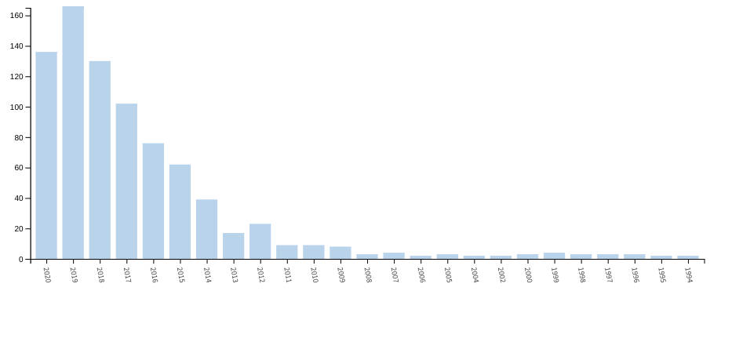
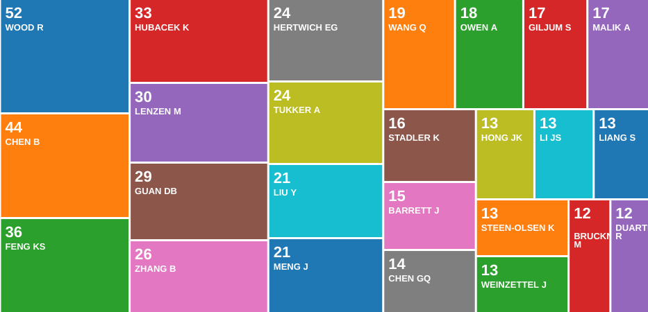
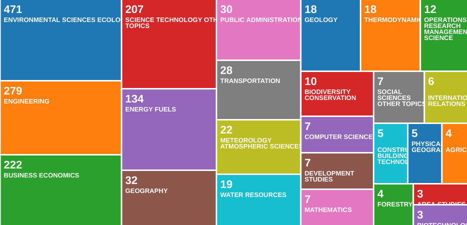
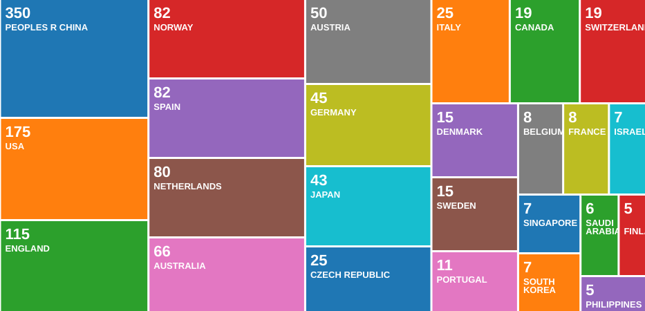

# What is LE-MRIO and why is it applicable to studying landscapes?

## The Anthropocene context

## Landscape Extensions: Economic trade as models of ecological impacts

# What has been done so far? 

## wos_mrio_time.jpg

## wos_mrio_auth.jpg

## wos_mrio_funding.jp

## wos_mrio_field.jp

## wos_mrio_region.jpg

## LE-MRIO Models and Databases

## Footprint and Virtual Analyses

- Accounting
- A vast literature
- Majority have been done in China
- Soy-Forest Study
- Tian 2019
- Chen 2019
- Others?

## Ecosystem Network Analysis

- ?

## Structural Analyses

- ?

# What should/could be done? Low hanging fruit and far-off orchards.

## Major network structure-function hypotheses

- Small-World
- Self-similarity and scaling
- Modularity
- Nestedness
- Robustness indicators
- Uncertainty

## Conclusion
