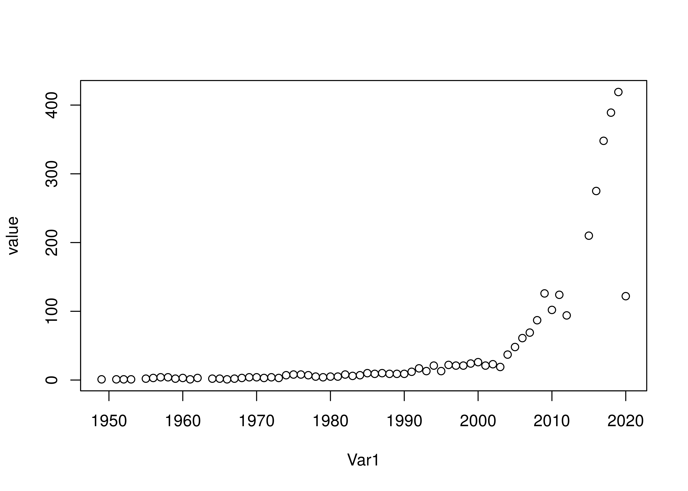

-   Resilience metrics for networks of embodied landscapes
-   Landscape context
-   Disturbances
-   Conversion
-   What is resilience?
-   Ecology and resilience
-   Complex systems resilience
    -   MacArthur
    -   May
    -   Ulanowicz
    -   Sheffer
-   Environmental embodied trade networks
-   IO background
-   Environmental/Social
-   Landscapes
-   Network metrics and resilience
-   FATH
-   Bascompte
-   Ulanowicz
-   Review methods and overview
-   Review: Metrics
-   IO -&gt; MRIO -&gt; EEMRIO
-   LEMRIO
-   IO overlap with ENA
-   ENA(IO) + ENA(LEMRIO)
-   Needs and Directions
-   Climate change
-   Disturbance

Analyses
========

-   What work has been done on landscape mrio?
-   What work has addressed resilience and stability?
-   What ENA metrics have been or could be applied?

<!-- -->

    loadd(io.bdf)

keyword+title: mrio & landscape
-------------------------------

    q.ml <- grepl("^LAND", io.bdf[, "DE"]) | 
        grepl("^LAND", io.bdf[, "TI"]) | 
        grepl(" LAND", io.bdf[, "DE"]) | 
        grepl(" LAND", io.bdf[, "TI"]) 

keyword+title: mrio & network/ena
---------------------------------

    q.net <- (grepl("NETWORK ANALYS", io.bdf[, "DE"]) | 
        grepl("NETWORK ANALYS", io.bdf[, "TI"])) & 
        !(grepl("ECOLOGICAL NETWORK ANALYS", io.bdf[, "DE"]) | 
        grepl("ECOLOGICAL NETWORK ANALYS", io.bdf[, "TI"]))
    q.me <- grepl("ECOLOGICAL NETWORK ANALYS", io.bdf[, "DE"]) | 
        grepl("ECOLOGICAL NETWORK ANALYS", io.bdf[, "TI"]) &
        !(q.net)

keyword+title: resilience
-------------------------

    q.res <- grepl("^RESILIEN", io.bdf[, "TI"]) | 
        grepl("^RESILIEN", io.bdf[, "DE"]) | 
        grepl(" RESILIEN", io.bdf[, "TI"]) | 
        grepl(" RESILIEN", io.bdf[, "DE"]) 
    q.res.abs <- grepl("^RESILIEN", io.bdf[, "TI"]) | 
        grepl("^RESILIEN", io.bdf[, "DE"]) | 
        grepl(" RESILIEN", io.bdf[, "TI"]) | 
        grepl(" RESILIEN", io.bdf[, "DE"]) | 
        grepl("^RESILIEN", io.bdf[, "AB"]) | 
        grepl(" RESILIEN", io.bdf[, "AB"]) 

keyword+title: disturbance(climate change, other)
-------------------------------------------------

    q.mc <- grepl("^CLIMATE", io.bdf[, "TI"]) | 
        grepl("^CLIMATE", io.bdf[, "DE"]) | 
        grepl(" CLIMATE", io.bdf[, "TI"]) | 
        grepl(" CLIMATE", io.bdf[, "DE"]) 

    q.md <- grepl("^DISTURB", io.bdf[, "TI"]) | 
        grepl("^DISTURB", io.bdf[, "DE"]) | 
        grepl(" DISTURB", io.bdf[, "TI"]) | 
        grepl(" DISTURB", io.bdf[, "DE"]) 

keyword+title: coupled-human natural systems
--------------------------------------------

    io.bdf[q.res.abs & q.ml, "AB"]

    ## character(0)

keyword+title: ena & resilience+stability & metrics
---------------------------------------------------

    io.bdf[q.res.abs & q.ml, "AB"]

    ## character(0)

type: review
------------

    io.bdf[q.res.abs & q.ml, "AB"]

    ## character(0)

Figure caption here

@ref(fig:figRef)

@ref(tab:tabRef)

References
==========
