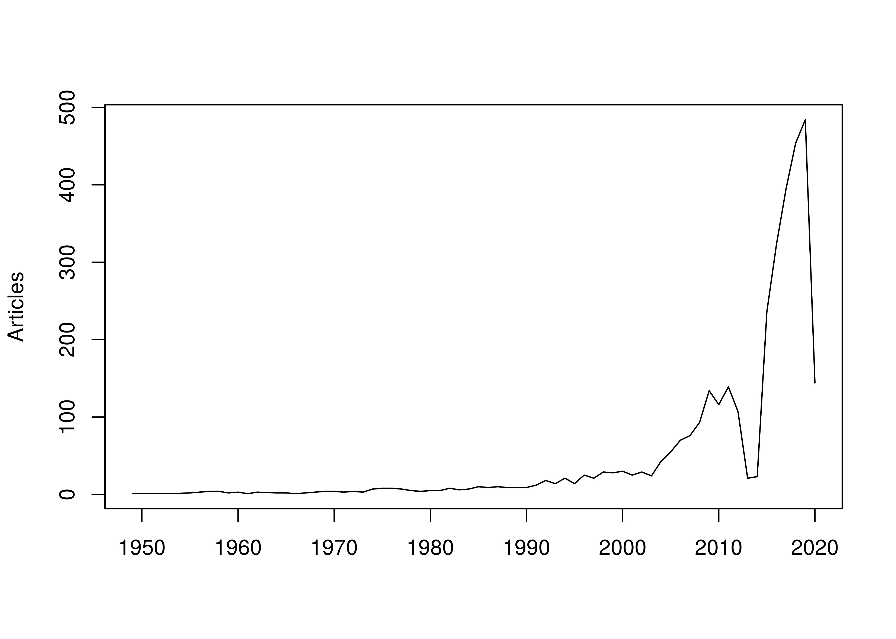
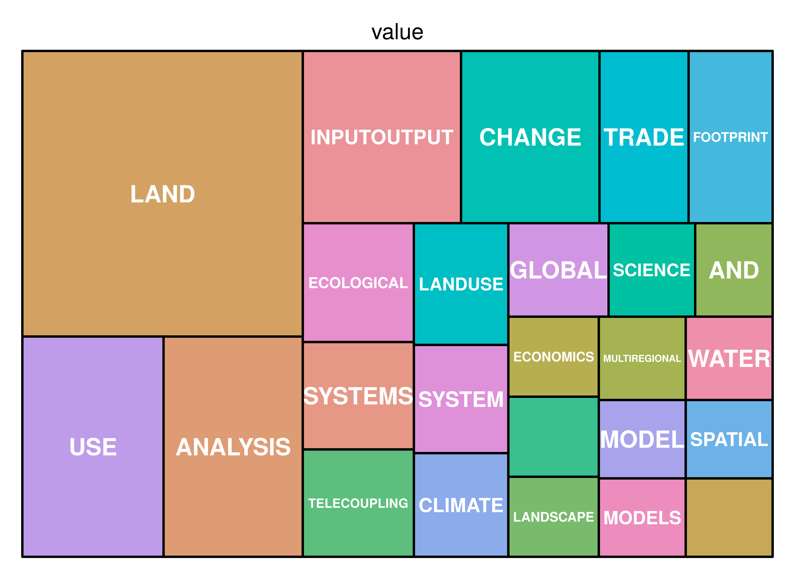

-   Resilience metrics for networks of embodied landscapes
-   Landscape context
-   Disturbances
-   Conversion
-   What is resilience?
-   Ecology and resilience
-   Complex systems resilience
    -   MacArthur
    -   May
    -   Ulanowicz
    -   Sheffer
-   Environmental embodied trade networks
-   IO background
-   Environmental/Social
-   Landscapes
-   Network metrics and resilience
-   FATH
-   Bascompte
-   Ulanowicz
-   Review methods and overview
-   Review: Metrics
-   IO -&gt; MRIO -&gt; EEMRIO
-   LEMRIO
-   IO overlap with ENA
-   ENA(IO) + ENA(LEMRIO)
-   Needs and Directions
-   Climate change
-   Disturbance

Analyses
========

-   What work has been done on landscape mrio?
-   What work has addressed resilience and stability?
-   What ENA metrics have been or could be applied?

<!-- -->

    loadd(io.bdf)

keyword+title: mrio & landscape
-------------------------------

    q.ml <- grepl("^LAND", io.bdf[, "DE"]) | 
        grepl("^LAND", io.bdf[, "TI"]) | 
        grepl(" LAND", io.bdf[, "DE"]) | 
        grepl(" LAND", io.bdf[, "TI"]) 

keyword+title: mrio & network/ena
---------------------------------

    q.net <- (grepl("NETWORK ANALYS", io.bdf[, "DE"]) | 
        grepl("NETWORK ANALYS", io.bdf[, "TI"])) & 
        !(grepl("ECOLOGICAL NETWORK ANALYS", io.bdf[, "DE"]) | 
        grepl("ECOLOGICAL NETWORK ANALYS", io.bdf[, "TI"]))
    q.ena <- grepl("ECOLOGICAL NETWORK ANALYS", io.bdf[, "DE"]) | 
        grepl("ECOLOGICAL NETWORK ANALYS", io.bdf[, "TI"]) &
        !(q.net)

keyword+title: resilience
-------------------------

    q.res <- grepl("^RESILIEN", io.bdf[, "TI"]) | 
        grepl("^RESILIEN", io.bdf[, "DE"]) | 
        grepl(" RESILIEN", io.bdf[, "TI"]) | 
        grepl(" RESILIEN", io.bdf[, "DE"]) 
    q.res.abs <- grepl("^RESILIEN", io.bdf[, "TI"]) | 
        grepl("^RESILIEN", io.bdf[, "DE"]) | 
        grepl(" RESILIEN", io.bdf[, "TI"]) | 
        grepl(" RESILIEN", io.bdf[, "DE"]) | 
        grepl("^RESILIEN", io.bdf[, "AB"]) | 
        grepl(" RESILIEN", io.bdf[, "AB"]) 

keyword+title: disturbance(climate change, other)
-------------------------------------------------

    q.mc <- grepl("^CLIMATE", io.bdf[, "TI"]) | 
        grepl("^CLIMATE", io.bdf[, "DE"]) | 
        grepl(" CLIMATE", io.bdf[, "TI"]) | 
        grepl(" CLIMATE", io.bdf[, "DE"]) 
    q.md <- grepl("^DISTURB", io.bdf[, "TI"]) | 
        grepl("^DISTURB", io.bdf[, "DE"]) | 
        grepl(" DISTURB", io.bdf[, "TI"]) | 
        grepl(" DISTURB", io.bdf[, "DE"]) 

keyword+title: coupled-human natural systems
--------------------------------------------

    q.chns <- grepl("HUMAN-NATURAL", io.bdf[, "TI"]) | 
        grepl("HUMAN-NATURAL", io.bdf[, "DE"]) |
        grepl("HUMAN-NATURAL", io.bdf[, "AB"]) |
        grepl("HUMAN NATURAL", io.bdf[, "TI"]) | 
        grepl("HUMAN NATURAL", io.bdf[, "DE"]) |
        grepl("HUMAN NATURAL", io.bdf[, "AB"]) 

keyword+title: ena & resilience+stability & metrics
---------------------------------------------------

    q.met <- grepl(" METRIC", io.bdf[, "TI"]) | 
        grepl(" METRIC", io.bdf[, "DE"]) |
        grepl(" METRIC", io.bdf[, "AB"]) |
        grepl("^METRIC", io.bdf[, "TI"]) | 
        grepl("^METRIC", io.bdf[, "DE"]) |
        grepl("^METRIC", io.bdf[, "AB"]) & 
        q.net &
        q.res
    q.met.land <- q.met & q.ml

type: review
------------

    q.rev <- grepl("REVIEW", io.bdf[, "DT"]) | 
        grepl("REVIEW", io.bdf[, "DE"]) | 
        grepl("REVIEW", io.bdf[, "TI"]) 
    q.ov <- grepl("OVERVIEW", io.bdf[, "DT"]) |
        grepl("OVERVIEW", io.bdf[, "DE"]) | 
        grepl("OVERVIEW", io.bdf[, "TI"]) 
    io.bdf[q.rev | q.ov, c("PY", "AU", "TI")]

    ##                                                PY
    ## KAN SY, 2019, ENERGY POLICY                  2019
    ## WU XD, 2018, LAND USE POL                    2018
    ## ROBINSON OJ, 2018, J CLEAN PROD              2018
    ## LOMBARDI M, 2017, ENVIRON IMPACT ASSESS REV  2017
    ## GWENHURE Y, 2017, TOURISM                    2017
    ## DI DONATO M, 2015, J IND ECOL                2015
    ## SCHAFFARTZIK A, 2015, J IND ECOL             2015
    ## ZHANG X, 2015, J CLEAN PROD                  2015
    ## BRUCKNER M, 2015, ECOL ECON                  2015
    ## NIEUWOUDT WL, 2011, WATER SA                 2011
    ## MINX JC, 2009, ECON SYST RES                 2009
    ## TUKKER A, 2006, J IND ECOL                   2006
    ## BHASKARAN R, 2005, ANTI-CORROS METHODS MATER 2005
    ## LENZEN M, 2002, RENEW ENERGY                 2002
    ## PANDYA KV, 1995, IEE PROC -SCI MEAS TECHNOL  1995
    ## HOSTIOU N, 2020, J RURAL STUD                2020
    ## WU XD, 2019, J HYDROL                        2019
    ## WU XF, 2019, ENERGY POLICY                   2019
    ## WU XD, 2019, ENERGY POLICY-a                 2019
    ##                                                                                                                                                                             AU
    ## KAN SY, 2019, ENERGY POLICY                                                                                                                KAN SY;CHEN B;WU XF;CHEN ZM;CHEN GQ
    ## WU XD, 2018, LAND USE POL                                                                                                                          WU XD;GUO JL;HAN MY;CHEN GQ
    ## ROBINSON OJ, 2018, J CLEAN PROD                                                                                                    ROBINSON OJ;TEWKESBURY A;KEMP S;WILLIAMS ID
    ## LOMBARDI M, 2017, ENVIRON IMPACT ASSESS REV                                                                                                      LOMBARDI M;LAIOLA E;TRICASE R
    ## GWENHURE Y, 2017, TOURISM                                                                                                                               GWENHURE Y;ODHIAMBO NM
    ## DI DONATO M, 2015, J IND ECOL                                                                                                                DI DONATO M;LOMAS PL;CARPINTERO O
    ## SCHAFFARTZIK A, 2015, J IND ECOL                                                                                        SCHAFFARTZIK A;HABERL H;KASTNER D;EISENMENGER N;ERB KH
    ## ZHANG X, 2015, J CLEAN PROD                                                                                                                           ZHANG X;LUO L;SKITMORE M
    ## BRUCKNER M, 2015, ECOL ECON                                                                                                                  BRUCKNER M;FISCHER G;TRAMBEREND S
    ## NIEUWOUDT WL, 2011, WATER SA                                                                                                                         NIEUWOUDT WL;BACKEBERG GR
    ## MINX JC, 2009, ECON SYST RES                 MINX JC;WIEDMANN T;WOOD R;PETERS GP;LENZEN M;OWEN A;SCOTT K;BARRETT J;HUBACEK G;PAUL A;DAWKINS E;BRIGGS J;GUAN D;SUH S;ACKERMAN F
    ## TUKKER A, 2006, J IND ECOL                                                                                                                                   TUKKER A;JANSEN B
    ## BHASKARAN R, 2005, ANTI-CORROS METHODS MATER                                                                            BHASKARAN R;PALANISWAMY N;RENGASWAMY NS;JAYACHANDRAN M
    ## LENZEN M, 2002, RENEW ENERGY                                                                                                                             LENZEN M;MUNKSGAARD J
    ## PANDYA KV, 1995, IEE PROC -SCI MEAS TECHNOL                                                                                                                          PANDYA KV
    ## HOSTIOU N, 2020, J RURAL STUD                                                                                                           HOSTIOU N;VOLLET D;BENOIT M;DELFOSSE C
    ## WU XD, 2019, J HYDROL                                                                                                                         WU XD;GUO JL;LI CH;SHAO L;HAN GQ
    ## WU XF, 2019, ENERGY POLICY                                                                                                                                       WU XF;CHEN GQ
    ## WU XD, 2019, ENERGY POLICY-a                                                                                                                         WU XD;GUO JL;JI X;CHEN GQ
    ##                                                                                                                                                                                                                  TI
    ## KAN SY, 2019, ENERGY POLICY                                                                                    NATURAL GAS OVERVIEW FOR WORLD ECONOMY: FROM PRIMARY SUPPLY TO FINAL DEMAND VIA GLOBAL SUPPLY CHAINS
    ## WU XD, 2018, LAND USE POL                                                                                     AN OVERVIEW OF ARABLE LAND USE FOR THE WORLD ECONOMY: FROM SOURCE TO SINK VIA THE GLOBAL SUPPLY CHAIN
    ## ROBINSON OJ, 2018, J CLEAN PROD                                                                                    TOWARDS A UNIVERSAL CARBON FOOTPRINT STANDARD: A CASE STUDY OF CARBON MANAGEMENT AT UNIVERSITIES
    ## LOMBARDI M, 2017, ENVIRON IMPACT ASSESS REV                                                                                                                       ASSESSING THE URBAN CARBON FOOTPRINT: AN OVERVIEW
    ## GWENHURE Y, 2017, TOURISM                                                                                                                         TOURISM AND ECONOMIC GROWTH: A REVIEW OF INTERNATIONAL LITERATURE
    ## DI DONATO M, 2015, J IND ECOL                                                                   METABOLISM AND ENVIRONMENTAL IMPACTS OF HOUSEHOLD CONSUMPTION: A REVIEW ON THE ASSESSMENT, METHODOLOGY, AND DRIVERS
    ## SCHAFFARTZIK A, 2015, J IND ECOL                                                                               TRADING LAND: A REVIEW OF APPROACHES TO ACCOUNTING FOR UPSTREAM LAND REQUIREMENTS OF TRADED PRODUCTS
    ## ZHANG X, 2015, J CLEAN PROD                                                                   HOUSEHOLD CARBON EMISSION RESEARCH: AN ANALYTICAL REVIEW OF MEASUREMENT, INFLUENCING FACTORS AND MITIGATION PROSPECTS
    ## BRUCKNER M, 2015, ECOL ECON                                                             MEASURING TELECOUPLINGS IN THE GLOBAL LAND SYSTEM: A REVIEW AND COMPARATIVE EVALUATION OF LAND FOOTPRINT ACCOUNTING METHODS
    ## NIEUWOUDT WL, 2011, WATER SA                                                                                                     A REVIEW OF THE MODELLING OF WATER VALUES IN DIFFERENT USE SECTORS IN SOUTH AFRICA
    ## MINX JC, 2009, ECON SYST RES                                                                                                             INPUT-OUTPUT ANALYSIS AND CARBON FOOTPRINTING: AN OVERVIEW OF APPLICATIONS
    ## TUKKER A, 2006, J IND ECOL                                                                                                                           ENVIRONMENT IMPACTS OF PRODUCTS - A DETAILED REVIEW OF STUDIES
    ## BHASKARAN R, 2005, ANTI-CORROS METHODS MATER A REVIEW OF DIFFERING APPROACHES USED TO ESTIMATE THE COST OF CORROSION (AND THEIR RELEVANCE IN THE DEVELOPMENT OF MODERN CORROSION PREVENTION AND CONTROL STRATEGIES)
    ## LENZEN M, 2002, RENEW ENERGY                                                                                                          ENERGY AND CO2 LIFE-CYCLE ANALYSES OF WIND TURBINES - REVIEW AND APPLICATIONS
    ## PANDYA KV, 1995, IEE PROC -SCI MEAS TECHNOL                                                                                 REVIEW OF MODELING TECHNIQUES AND TOOLS FOR DECISION-MAKING IN MANUFACTURING MANAGEMENT
    ## HOSTIOU N, 2020, J RURAL STUD                                                                                                           EMPLOYMENT AND FARMERS' WORK IN EUROPEAN RUMINANT LIVESTOCK FARMS: A REVIEW
    ## WU XD, 2019, J HYDROL                                                        GLOBAL SOCIO-HYDROLOGY: AN OVERVIEW OF VIRTUAL WATER USE BY THE WORLD ECONOMY FROM SOURCE OF EXPLOITATION TO SINK OF FINAL CONSUMPTION
    ## WU XF, 2019, ENERGY POLICY                                                                                                       GLOBAL OVERVIEW OF CRUDE OIL USE: FROM SOURCE TO SINK THROUGH INTER-REGIONAL TRADE
    ## WU XD, 2019, ENERGY POLICY-a                                                                                                               ENERGY USE IN WORLD ECONOMY FROM HOUSEHOLD-CONSUMPTION-BASED PERSPECTIVE

Papers
======

Reviews/Overviews
-----------------

    io.bdf[q.rev | q.ov, c("PY", "AU", "TI")]

    ##                                                PY
    ## KAN SY, 2019, ENERGY POLICY                  2019
    ## WU XD, 2018, LAND USE POL                    2018
    ## ROBINSON OJ, 2018, J CLEAN PROD              2018
    ## LOMBARDI M, 2017, ENVIRON IMPACT ASSESS REV  2017
    ## GWENHURE Y, 2017, TOURISM                    2017
    ## DI DONATO M, 2015, J IND ECOL                2015
    ## SCHAFFARTZIK A, 2015, J IND ECOL             2015
    ## ZHANG X, 2015, J CLEAN PROD                  2015
    ## BRUCKNER M, 2015, ECOL ECON                  2015
    ## NIEUWOUDT WL, 2011, WATER SA                 2011
    ## MINX JC, 2009, ECON SYST RES                 2009
    ## TUKKER A, 2006, J IND ECOL                   2006
    ## BHASKARAN R, 2005, ANTI-CORROS METHODS MATER 2005
    ## LENZEN M, 2002, RENEW ENERGY                 2002
    ## PANDYA KV, 1995, IEE PROC -SCI MEAS TECHNOL  1995
    ## HOSTIOU N, 2020, J RURAL STUD                2020
    ## WU XD, 2019, J HYDROL                        2019
    ## WU XF, 2019, ENERGY POLICY                   2019
    ## WU XD, 2019, ENERGY POLICY-a                 2019
    ##                                                                                                                                                                             AU
    ## KAN SY, 2019, ENERGY POLICY                                                                                                                KAN SY;CHEN B;WU XF;CHEN ZM;CHEN GQ
    ## WU XD, 2018, LAND USE POL                                                                                                                          WU XD;GUO JL;HAN MY;CHEN GQ
    ## ROBINSON OJ, 2018, J CLEAN PROD                                                                                                    ROBINSON OJ;TEWKESBURY A;KEMP S;WILLIAMS ID
    ## LOMBARDI M, 2017, ENVIRON IMPACT ASSESS REV                                                                                                      LOMBARDI M;LAIOLA E;TRICASE R
    ## GWENHURE Y, 2017, TOURISM                                                                                                                               GWENHURE Y;ODHIAMBO NM
    ## DI DONATO M, 2015, J IND ECOL                                                                                                                DI DONATO M;LOMAS PL;CARPINTERO O
    ## SCHAFFARTZIK A, 2015, J IND ECOL                                                                                        SCHAFFARTZIK A;HABERL H;KASTNER D;EISENMENGER N;ERB KH
    ## ZHANG X, 2015, J CLEAN PROD                                                                                                                           ZHANG X;LUO L;SKITMORE M
    ## BRUCKNER M, 2015, ECOL ECON                                                                                                                  BRUCKNER M;FISCHER G;TRAMBEREND S
    ## NIEUWOUDT WL, 2011, WATER SA                                                                                                                         NIEUWOUDT WL;BACKEBERG GR
    ## MINX JC, 2009, ECON SYST RES                 MINX JC;WIEDMANN T;WOOD R;PETERS GP;LENZEN M;OWEN A;SCOTT K;BARRETT J;HUBACEK G;PAUL A;DAWKINS E;BRIGGS J;GUAN D;SUH S;ACKERMAN F
    ## TUKKER A, 2006, J IND ECOL                                                                                                                                   TUKKER A;JANSEN B
    ## BHASKARAN R, 2005, ANTI-CORROS METHODS MATER                                                                            BHASKARAN R;PALANISWAMY N;RENGASWAMY NS;JAYACHANDRAN M
    ## LENZEN M, 2002, RENEW ENERGY                                                                                                                             LENZEN M;MUNKSGAARD J
    ## PANDYA KV, 1995, IEE PROC -SCI MEAS TECHNOL                                                                                                                          PANDYA KV
    ## HOSTIOU N, 2020, J RURAL STUD                                                                                                           HOSTIOU N;VOLLET D;BENOIT M;DELFOSSE C
    ## WU XD, 2019, J HYDROL                                                                                                                         WU XD;GUO JL;LI CH;SHAO L;HAN GQ
    ## WU XF, 2019, ENERGY POLICY                                                                                                                                       WU XF;CHEN GQ
    ## WU XD, 2019, ENERGY POLICY-a                                                                                                                         WU XD;GUO JL;JI X;CHEN GQ
    ##                                                                                                                                                                                                                  TI
    ## KAN SY, 2019, ENERGY POLICY                                                                                    NATURAL GAS OVERVIEW FOR WORLD ECONOMY: FROM PRIMARY SUPPLY TO FINAL DEMAND VIA GLOBAL SUPPLY CHAINS
    ## WU XD, 2018, LAND USE POL                                                                                     AN OVERVIEW OF ARABLE LAND USE FOR THE WORLD ECONOMY: FROM SOURCE TO SINK VIA THE GLOBAL SUPPLY CHAIN
    ## ROBINSON OJ, 2018, J CLEAN PROD                                                                                    TOWARDS A UNIVERSAL CARBON FOOTPRINT STANDARD: A CASE STUDY OF CARBON MANAGEMENT AT UNIVERSITIES
    ## LOMBARDI M, 2017, ENVIRON IMPACT ASSESS REV                                                                                                                       ASSESSING THE URBAN CARBON FOOTPRINT: AN OVERVIEW
    ## GWENHURE Y, 2017, TOURISM                                                                                                                         TOURISM AND ECONOMIC GROWTH: A REVIEW OF INTERNATIONAL LITERATURE
    ## DI DONATO M, 2015, J IND ECOL                                                                   METABOLISM AND ENVIRONMENTAL IMPACTS OF HOUSEHOLD CONSUMPTION: A REVIEW ON THE ASSESSMENT, METHODOLOGY, AND DRIVERS
    ## SCHAFFARTZIK A, 2015, J IND ECOL                                                                               TRADING LAND: A REVIEW OF APPROACHES TO ACCOUNTING FOR UPSTREAM LAND REQUIREMENTS OF TRADED PRODUCTS
    ## ZHANG X, 2015, J CLEAN PROD                                                                   HOUSEHOLD CARBON EMISSION RESEARCH: AN ANALYTICAL REVIEW OF MEASUREMENT, INFLUENCING FACTORS AND MITIGATION PROSPECTS
    ## BRUCKNER M, 2015, ECOL ECON                                                             MEASURING TELECOUPLINGS IN THE GLOBAL LAND SYSTEM: A REVIEW AND COMPARATIVE EVALUATION OF LAND FOOTPRINT ACCOUNTING METHODS
    ## NIEUWOUDT WL, 2011, WATER SA                                                                                                     A REVIEW OF THE MODELLING OF WATER VALUES IN DIFFERENT USE SECTORS IN SOUTH AFRICA
    ## MINX JC, 2009, ECON SYST RES                                                                                                             INPUT-OUTPUT ANALYSIS AND CARBON FOOTPRINTING: AN OVERVIEW OF APPLICATIONS
    ## TUKKER A, 2006, J IND ECOL                                                                                                                           ENVIRONMENT IMPACTS OF PRODUCTS - A DETAILED REVIEW OF STUDIES
    ## BHASKARAN R, 2005, ANTI-CORROS METHODS MATER A REVIEW OF DIFFERING APPROACHES USED TO ESTIMATE THE COST OF CORROSION (AND THEIR RELEVANCE IN THE DEVELOPMENT OF MODERN CORROSION PREVENTION AND CONTROL STRATEGIES)
    ## LENZEN M, 2002, RENEW ENERGY                                                                                                          ENERGY AND CO2 LIFE-CYCLE ANALYSES OF WIND TURBINES - REVIEW AND APPLICATIONS
    ## PANDYA KV, 1995, IEE PROC -SCI MEAS TECHNOL                                                                                 REVIEW OF MODELING TECHNIQUES AND TOOLS FOR DECISION-MAKING IN MANUFACTURING MANAGEMENT
    ## HOSTIOU N, 2020, J RURAL STUD                                                                                                           EMPLOYMENT AND FARMERS' WORK IN EUROPEAN RUMINANT LIVESTOCK FARMS: A REVIEW
    ## WU XD, 2019, J HYDROL                                                        GLOBAL SOCIO-HYDROLOGY: AN OVERVIEW OF VIRTUAL WATER USE BY THE WORLD ECONOMY FROM SOURCE OF EXPLOITATION TO SINK OF FINAL CONSUMPTION
    ## WU XF, 2019, ENERGY POLICY                                                                                                       GLOBAL OVERVIEW OF CRUDE OIL USE: FROM SOURCE TO SINK THROUGH INTER-REGIONAL TRADE
    ## WU XD, 2019, ENERGY POLICY-a                                                                                                               ENERGY USE IN WORLD ECONOMY FROM HOUSEHOLD-CONSUMPTION-BASED PERSPECTIVE

ENA/Network
-----------

    io.bdf[q.ena | q.ov, c("PY", "AU", "TI")]

    ##                                               PY
    ## WANG S, 2019, APPL ENERGY                   2019
    ## KAN SY, 2019, ENERGY POLICY                 2019
    ## GUAN Y, 2019, ENVIRON POLLUT                2019
    ## ZHANG X, 2018, ECOL INDIC                   2018
    ## TAN LM, 2018, RESOUR CONSERV RECYCL         2018
    ## DUAN C, 2018, APPL ENERGY                   2018
    ## WANG S, 2018, APPL ENERGY-a                 2018
    ## LI J, 2018, ECOL MODEL                      2018
    ## WU XD, 2018, LAND USE POL                   2018
    ## WANG X, 2018, SUSTAINABILITY                2018
    ## ZHENG H, 2018, RESOUR CONSERV RECYCL        2018
    ## HAO Y, 2018, ECOL MODEL                     2018
    ## LOMBARDI M, 2017, ENVIRON IMPACT ASSESS REV 2017
    ## KAZANCI C, 2017, ECOL MODEL                 2017
    ## DUAN C, 2017, APPL ENERGY                   2017
    ## ZHANG Y, 2017, ECOL MODEL                   2017
    ## FARRELL SL, 2017, J ETHOL                   2017
    ## YANG S, 2016, APPL ENERGY                   2016
    ## BORRETT SR, 2016, J COMPLEX NETW            2016
    ## WANG S, 2016, APPL ENERGY                   2016
    ## ZHANG Y, 2016, J IND ECOL                   2016
    ## GUO R, 2016, APPL ENERGY                    2016
    ## ZHANG Y, 2016, J CLEAN PROD                 2016
    ## ZHANG Y, 2015, ENERGY POLICY-a              2015
    ## CHEN S, 2015, APPL ENERGY                   2015
    ## BORRETT SR, 2011, ECOL MODEL-a              2011
    ## MATAMBA L, 2009, ECOL MODEL                 2009
    ## MINX JC, 2009, ECON SYST RES                2009
    ## FATH BD, 2006, ENVIRON MODELL SOFTW         2006
    ## WEN Q, 2020, J ENVIRON MANAGE               2020
    ## WANG X, 2019, J CLEAN PROD                  2019
    ## TAN LM, 2019, APPL ENERGY                   2019
    ## WU JUNNIAN WJ, 2019, RESOUR CONSERV RECYCL  2019
    ## CHEN S, 2019, ENERGY                        2019
    ## ZHAI M, 2019, J CLEAN PROD                  2019
    ## WU XD, 2019, J HYDROL                       2019
    ## WANG X, 2019, SUSTAINABILITY                2019
    ## WU XF, 2019, ENERGY POLICY                  2019
    ## ZHENG B, 2019, J CLEAN PROD                 2019
    ## WU XD, 2019, ENERGY POLICY-a                2019
    ## FANG D, 2019, APPL ENERGY                   2019
    ## LIU Y, 2019, ECOL INDIC                     2019
    ##                                                                                                                                                                            AU
    ## WANG S, 2019, APPL ENERGY                                                                                                                                WANG S;FATH B;CHEN B
    ## KAN SY, 2019, ENERGY POLICY                                                                                                               KAN SY;CHEN B;WU XF;CHEN ZM;CHEN GQ
    ## GUAN Y, 2019, ENVIRON POLLUT                                                                                                                     GUAN Y;HUANG G;LIU L;HUANG M
    ## ZHANG X, 2018, ECOL INDIC                                                                                                                   ZHANG X;HUANG G;LIU L;ZHAI M;LI J
    ## TAN LM, 2018, RESOUR CONSERV RECYCL                                                                                           TAN LM;ARBABI H;LI Q;SHENG DD;MAYFIELD M;COCA D
    ## DUAN C, 2018, APPL ENERGY                                                                                                DUAN C;CHEN B;FENG K;LIU Z;HAYAT T;ALSAEDI A;AHMAD B
    ## WANG S, 2018, APPL ENERGY-a                                                                                                                               WANG S;LIU Y;CHEN B
    ## LI J, 2018, ECOL MODEL                                                                                                                                     LI J;HUANG G;LIU L
    ## WU XD, 2018, LAND USE POL                                                                                                                         WU XD;GUO JL;HAN MY;CHEN GQ
    ## WANG X, 2018, SUSTAINABILITY                                                                                                           WANG X;TANG X;ZHANG B;MCLELLAN BC;LV Y
    ## ZHENG H, 2018, RESOUR CONSERV RECYCL                                                                                                              ZHENG H;WANG X;LI M;ZHANG Y
    ## HAO Y, 2018, ECOL MODEL                                                                                                                       HAO Y;ZHANG M;ZHANG Y;FU C;LU Z
    ## LOMBARDI M, 2017, ENVIRON IMPACT ASSESS REV                                                                                                     LOMBARDI M;LAIOLA E;TRICASE R
    ## KAZANCI C, 2017, ECOL MODEL                                                                                                                                KAZANCI C;ADAMS MR
    ## DUAN C, 2017, APPL ENERGY                                                                                                                                       DUAN C;CHEN B
    ## ZHANG Y, 2017, ECOL MODEL                                                                                                                                ZHANG Y;LI Y;ZHENG H
    ## FARRELL SL, 2017, J ETHOL                                                                                                                                 FARRELL SL;ANDOW DA
    ## YANG S, 2016, APPL ENERGY                                                                                                                                YANG S;FATH B;CHEN B
    ## BORRETT SR, 2016, J COMPLEX NETW                                                                                                                 BORRETT SR;CARTER M;HINES DE
    ## WANG S, 2016, APPL ENERGY                                                                                                                                       WANG S;CHEN B
    ## ZHANG Y, 2016, J IND ECOL                                                                                                    ZHANG Y;ZHENG H;CHEN B;YU X;HUBACEK K;WU R;SUN X
    ## GUO R, 2016, APPL ENERGY                                                                                                                             GUO R;ZHU X;CHEN B;YUE Y
    ## ZHANG Y, 2016, J CLEAN PROD                                                                                                      ZHANG Y;ZHENG H;YANG Z;LI Y;LIU G;SU M;YIN X
    ## ZHANG Y, 2015, ENERGY POLICY-a                                                                                                         ZHANG Y;ZHENG H;YANG Z;SU M;LIU G;LI Y
    ## CHEN S, 2015, APPL ENERGY                                                                                                                                       CHEN S;CHEN B
    ## BORRETT SR, 2011, ECOL MODEL-a                                                                                                                  BORRETT SR;FREEZE MA;SALAS AK
    ## MATAMBA L, 2009, ECOL MODEL                                                                                             MATAMBA L;KAZANCI C;SCHRAMSKI JR;BLESSING P;PATTEN BC
    ## MINX JC, 2009, ECON SYST RES                MINX JC;WIEDMANN T;WOOD R;PETERS GP;LENZEN M;OWEN A;SCOTT K;BARRETT J;HUBACEK G;PAUL A;DAWKINS E;BRIGGS J;GUAN D;SUH S;ACKERMAN F
    ## FATH BD, 2006, ENVIRON MODELL SOFTW                                                                                                                        FATH BD;BORRETT SR
    ## WEN Q, 2020, J ENVIRON MANAGE                                                                                                           WEN Q;GU J;HONG J;SHEN GQ;LI Z;YUAN M
    ## WANG X, 2019, J CLEAN PROD                                                                                                                                WANG X;ZHANG Y;YU X
    ## TAN LM, 2019, APPL ENERGY                                                                                                   TAN LM;ARBABI H;BROCKWAY PE;TINGLEY DD;MAYFIELD M
    ## WU JUNNIAN WJ, 2019, RESOUR CONSERV RECYCL                                                           WU JUNNIAN WJ;LV JINGWEN LJ;SHANG JIANGWEI SJ;GUO YAN GY;PU;GUANGYING PG
    ## CHEN S, 2019, ENERGY                                                                                                                               CHEN S;ZHU F;LONG H;YANG J
    ## ZHAI M, 2019, J CLEAN PROD                                                                                                                       ZHAI M;HUANG G;LIU L;ZHANG X
    ## WU XD, 2019, J HYDROL                                                                                                                        WU XD;GUO JL;LI CH;SHAO L;HAN GQ
    ## WANG X, 2019, SUSTAINABILITY                                                                                                                     WANG X;TANG X;FENG Z;ZHANG Y
    ## WU XF, 2019, ENERGY POLICY                                                                                                                                      WU XF;CHEN GQ
    ## ZHENG B, 2019, J CLEAN PROD                                                                                                               ZHENG B;HUANG G;LIU L;ZHAI M;GUAN Y
    ## WU XD, 2019, ENERGY POLICY-a                                                                                                                        WU XD;GUO JL;JI X;CHEN GQ
    ## FANG D, 2019, APPL ENERGY                                                                                                                                       FANG D;CHEN B
    ## LIU Y, 2019, ECOL INDIC                                                                                                                                   LIU Y;WANG S;CHEN B
    ##                                                                                                                                                                                                                    TI
    ## WANG S, 2019, APPL ENERGY                                                                                            ENERGY WATER NEXUS UNDER ENERGY MIX SCENARIOS USING INPUT OUTPUT AND ECOLOGICAL NETWORK ANALYSES
    ## KAN SY, 2019, ENERGY POLICY                                                                                      NATURAL GAS OVERVIEW FOR WORLD ECONOMY: FROM PRIMARY SUPPLY TO FINAL DEMAND VIA GLOBAL SUPPLY CHAINS
    ## GUAN Y, 2019, ENVIRON POLLUT                                                                                                              ECOLOGICAL NETWORK ANALYSIS FOR AN INDUSTRIAL SOLID WASTE METABOLISM SYSTEM
    ## ZHANG X, 2018, ECOL INDIC                                                                                 ECOLOGICAL AND ECONOMIC ANALYSES OF THE FOREST METABOLISM SYSTEM: A CASE STUDY OF GUANGDONG PROVINCE, CHINA
    ## TAN LM, 2018, RESOUR CONSERV RECYCL                                                                               ECOLOGICAL NETWORK ANALYSIS ON INTRA-CITY METABOLISM OF FUNCTIONAL URBAN AREAS IN ENGLAND AND WALES
    ## DUAN C, 2018, APPL ENERGY                                                                                                                                                         INTERREGIONAL CARBON FLOWS OF CHINA
    ## WANG S, 2018, APPL ENERGY-a                                                                                   MULTIREGIONAL INPUT-OUTPUT AND ECOLOGICAL NETWORK ANALYSES FOR REGIONAL ENERGY-WATER NEXUS WITHIN CHINA
    ## LI J, 2018, ECOL MODEL                                                         ECOLOGICAL NETWORK ANALYSIS FOR URBAN METABOLISM AND CARBON EMISSIONS BASED ON INPUT-OUTPUT TABLES: A CASE STUDY OF GUANGDONG PROVINCE
    ## WU XD, 2018, LAND USE POL                                                                                       AN OVERVIEW OF ARABLE LAND USE FOR THE WORLD ECONOMY: FROM SOURCE TO SINK VIA THE GLOBAL SUPPLY CHAIN
    ## WANG X, 2018, SUSTAINABILITY                                                                                          PROVINCIAL CARBON EMISSIONS REDUCTION ALLOCATION PLAN IN CHINA BASED ON CONSUMPTION PERSPECTIVE
    ## ZHENG H, 2018, RESOUR CONSERV RECYCL                                                     INTERREGIONAL TRADE AMONG REGIONS OF URBAN ENERGY METABOLISM: A CASE STUDY BETWEEN BEIJING-TIANJIN-HEBEI AND OTHERS IN CHINA
    ## HAO Y, 2018, ECOL MODEL                                                                         MULTI-SCALE ANALYSIS OF THE ENERGY METABOLIC PROCESSES IN THE BEIJING-TIANJIN-HEBEI (JING-JIN-JI) URBAN AGGLOMERATION
    ## LOMBARDI M, 2017, ENVIRON IMPACT ASSESS REV                                                                                                                         ASSESSING THE URBAN CARBON FOOTPRINT: AN OVERVIEW
    ## KAZANCI C, 2017, ECOL MODEL                                                                                                                             ECOLOGICAL UTILITY THEORY: SOLVING A SERIES CONVERGENCE ISSUE
    ## DUAN C, 2017, APPL ENERGY                                                                                                                                   ENERGY-WATER NEXUS OF INTERNATIONAL ENERGY TRADE OF CHINA
    ## ZHANG Y, 2017, ECOL MODEL                                                                             ECOLOGICAL NETWORK ANALYSIS OF ENERGY METABOLISM IN THE BEIJING-TIANJIN-HEBEI (JING-JIN-JI) URBAN AGGLOMERATION
    ## FARRELL SL, 2017, J ETHOL                                                                                                                       HIGHLY VARIABLE MALE COURTSHIP BEHAVIORAL SEQUENCES IN A CRAMBID MOTH
    ## YANG S, 2016, APPL ENERGY                                                                                                      ECOLOGICAL NETWORK ANALYSIS OF EMBODIED PARTICULATE MATTER 2.5-A CASE STUDY OF BEIJING
    ## BORRETT SR, 2016, J COMPLEX NETW                                                                                  SIX GENERAL ECOSYSTEM PROPERTIES ARE MORE INTENSE IN BIOGEOCHEMICAL CYCLING NETWORKS THAN FOOD WEBS
    ## WANG S, 2016, APPL ENERGY                      ENERGY-WATER NEXUS OF URBAN AGGLOMERATION BASED ON MULTIREGIONAL INPUT-OUTPUT TABLES AND ECOLOGICAL NETWORK ANALYSIS: A CASE STUDY OF THE BEIJING-TIANJIN-HEBEI REGION
    ## ZHANG Y, 2016, J IND ECOL                                                                                                   ECOLOGICAL NETWORK ANALYSIS OF EMBODIED ENERGY EXCHANGES AMONG THE SEVEN REGIONS OF CHINA
    ## GUO R, 2016, APPL ENERGY                                                                               ECOLOGICAL NETWORK ANALYSIS OF THE VIRTUAL WATER NETWORK WITHIN CHINA'S ELECTRIC POWER SYSTEM DURING 2007-2012
    ## ZHANG Y, 2016, J CLEAN PROD                 URBAN ENERGY FLOW PROCESSES IN THE BEIJING-TIANJIN-HEBEI (JING-JIN-JI) URBAN AGGLOMERATION: COMBINING MULTI-REGIONAL INPUT-OUTPUT TABLES WITH ECOLOGICAL NETWORK ANALYSIS
    ## ZHANG Y, 2015, ENERGY POLICY-a                                                                     MULTI-REGIONAL INPUT-OUTPUT MODEL AND ECOLOGICAL NETWORK ANALYSIS FOR REGIONAL EMBODIED ENERGY ACCOUNTING IN CHINA
    ## CHEN S, 2015, APPL ENERGY                                                               URBAN ENERGY CONSUMPTION: DIFFERENT INSIGHTS FROM ENERGY FLOW ANALYSIS, INPUT-OUTPUT ANALYSIS AND ECOLOGICAL NETWORK ANALYSIS
    ## BORRETT SR, 2011, ECOL MODEL-a                                                                          EQUIVALENCE OF THE REALIZED INPUT AND OUTPUT ORIENTED INDIRECT EFFECTS METRICS IN ECOLOGICAL NETWORK ANALYSIS
    ## MATAMBA L, 2009, ECOL MODEL                                                                                                                                               THROUGHFLOW ANALYSIS: A STOCHASTIC APPROACH
    ## MINX JC, 2009, ECON SYST RES                                                                                                               INPUT-OUTPUT ANALYSIS AND CARBON FOOTPRINTING: AN OVERVIEW OF APPLICATIONS
    ## FATH BD, 2006, ENVIRON MODELL SOFTW                                                                                                                                A MATLAB (R) FUNCTION FOR NETWORK ENVIRON ANALYSIS
    ## WEN Q, 2020, J ENVIRON MANAGE                                                                               UNFOLDING INTERREGIONAL ENERGY FLOW STRUCTURE OF CHINA'S CONSTRUCTION SECTOR BASED ON PROVINCE-LEVEL DATA
    ## WANG X, 2019, J CLEAN PROD                                                                                       CHARACTERISTICS OF TIANJIN'S MATERIAL METABOLISM FROM THE PERSPECTIVE OF ECOLOGICAL NETWORK ANALYSIS
    ## TAN LM, 2019, APPL ENERGY                                                    AN ECOLOGICAL-THERMODYNAMIC APPROACH TO URBAN METABOLISM: MEASURING RESOURCE UTILIZATION WITH OPEN SYSTEM NETWORK EFFECTIVENESS ANALYSIS
    ## WU JUNNIAN WJ, 2019, RESOUR CONSERV RECYCL                                     EVALUATING CHROMIUM COUPLED WITH CARBON METABOLISM AND ENVIRONMENTAL PERFORMANCE IN THE CHROMATE INDUSTRIAL SYMBIOSIS NETWORK IN CHINA
    ## CHEN S, 2019, ENERGY                                                                                                  ENERGY FOOTPRINT CONTROLLED BY URBAN DEMANDS: HOW MUCH DOES SUPPLY CHAIN COMPLEXITY CONTRIBUTE?
    ## ZHAI M, 2019, J CLEAN PROD                                                    ECOLOGICAL NETWORK ANALYSIS OF AN ENERGY METABOLISM SYSTEM BASED ON INPUT-OUTPUT TABLES: MODEL DEVELOPMENT AND CASE STUDY FOR GUANGDONG
    ## WU XD, 2019, J HYDROL                                                          GLOBAL SOCIO-HYDROLOGY: AN OVERVIEW OF VIRTUAL WATER USE BY THE WORLD ECONOMY FROM SOURCE OF EXPLOITATION TO SINK OF FINAL CONSUMPTION
    ## WANG X, 2019, SUSTAINABILITY                                                        CHARACTERIZING THE EMBODIED CARBON EMISSIONS FLOWS AND ECOLOGICAL RELATIONSHIPS AMONG FOUR CHINESE MEGACITIES AND OTHER PROVINCES
    ## WU XF, 2019, ENERGY POLICY                                                                                                         GLOBAL OVERVIEW OF CRUDE OIL USE: FROM SOURCE TO SINK THROUGH INTER-REGIONAL TRADE
    ## ZHENG B, 2019, J CLEAN PROD                                                                                                 METABOLISM OF URBAN WASTEWATER: ECOLOGICAL NETWORK ANALYSIS FOR GUANGDONG PROVINCE, CHINA
    ## WU XD, 2019, ENERGY POLICY-a                                                                                                                 ENERGY USE IN WORLD ECONOMY FROM HOUSEHOLD-CONSUMPTION-BASED PERSPECTIVE
    ## FANG D, 2019, APPL ENERGY                                                                                                                          INFORMATION-BASED ECOLOGICAL NETWORK ANALYSIS FOR CARBON EMISSIONS
    ## LIU Y, 2019, ECOL INDIC                                                                                                                           WATER-LAND NEXUS IN FOOD TRADE BASED ON ECOLOGICAL NETWORK ANALYSIS

    io.bdf[q.net | q.ov, c("PY", "AU", "TI")]

    ##                                               PY
    ## KAN SY, 2019, ENERGY POLICY                 2019
    ## ZHAI M, 2018, J CLEAN PROD                  2018
    ## XIE Y, 2018, SUSTAINABILITY                 2018
    ## DUAN Y, 2018, J CLEAN PROD                  2018
    ## DU Q, 2018, ENVIRON SCI POLLUT RES          2018
    ## WU XD, 2018, LAND USE POL                   2018
    ## DISTEFANO T, 2018, WATER RESOUR ECON        2018
    ## CHEN Z, 2018, ENERGY POLICY                 2018
    ## TAN F, 2018, J CLEAN PROD                   2018
    ## SUN X, 2018, J CLEAN PROD                   2018
    ## CHEN B, 2018, APPL ENERGY                   2018
    ## MEEKES J, 2018, STATA J                     2018
    ## LI Z, 2017, J CLEAN PROD-a                  2017
    ## LOMBARDI M, 2017, ENVIRON IMPACT ASSESS REV 2017
    ## WANG Z, 2017, ECOL INDIC                    2017
    ## TSEKERIS T, 2017, J ECON INTERACT COORD     2017
    ## ZHENG H, 2017, J IND ECOL                   2017
    ## SCHUETZ MH, 2017, ECON SYST RES             2017
    ## CHEN S, 2016, APPL ENERGY                   2016
    ## PRELL C, 2016, J IND ECOL                   2016
    ## PRELL C, 2016, SOC SCI J                    2016
    ## ZHANG Y, 2015, J CLEAN PROD                 2015
    ## KAUFMAN AG, 2010, ECOL MODEL                2010
    ## MONTRESOR S, 2009, ECON SYST RES            2009
    ## MINX JC, 2009, ECON SYST RES                2009
    ## ULANOWICZ RE, 2008, ECOL MODEL              2008
    ## BORRETT SR, 2006, ECOL MODEL                2006
    ## SUH S, 2005, ECOL MODEL                     2005
    ## FATH BD, 2004, ECOL MODEL                   2004
    ## FATH BD, 1998, ECOL MODEL                   1998
    ## HEYMANS JJ, 1996, ESTUAR COAST SHELF SCI    1996
    ## ZHAO X, 2020, EARTH FUTURE                  2020
    ## HE C, 2020, ECOL INDIC                      2020
    ## HUANG L, 2019, SUSTAINABILITY               2019
    ## TIAN X, 2019, ENERGY                        2019
    ## LV K, 2019, J CLEAN PROD                    2019
    ## ZHA J, 2019, INT J TOUR RES                 2019
    ## CHEN B, 2019, SCI TOTAL ENVIRON             2019
    ## WU XD, 2019, J HYDROL                       2019
    ## WU XF, 2019, ENERGY POLICY                  2019
    ## WU XD, 2019, ENERGY POLICY-a                2019
    ## ZHAI M, 2019, RESOUR CONSERV RECYCL         2019
    ##                                                                                                                                                                            AU
    ## KAN SY, 2019, ENERGY POLICY                                                                                                               KAN SY;CHEN B;WU XF;CHEN ZM;CHEN GQ
    ## ZHAI M, 2018, J CLEAN PROD                                                                                                                          ZHAI M;HUANG G;LIU L;SU S
    ## XIE Y, 2018, SUSTAINABILITY                                                                                                                        XIE Y;JI L;ZHANG B;HUANG G
    ## DUAN Y, 2018, J CLEAN PROD                                                                                                                                     DUAN Y;JIANG X
    ## DU Q, 2018, ENVIRON SCI POLLUT RES                                                                                                                 DU Q;XU Y;WU M;SUN Q;BAI M
    ## WU XD, 2018, LAND USE POL                                                                                                                         WU XD;GUO JL;HAN MY;CHEN GQ
    ## DISTEFANO T, 2018, WATER RESOUR ECON                                                                                                          DISTEFANO T;RICCABONI M;MARIN G
    ## CHEN Z, 2018, ENERGY POLICY                                                                                                                              CHEN Z;HUANG Z;NIE P
    ## TAN F, 2018, J CLEAN PROD                                                                                                                                          TAN F;BI J
    ## SUN X, 2018, J CLEAN PROD                                                                                                                                          SUN X;AN H
    ## CHEN B, 2018, APPL ENERGY                                                                                                       CHEN B;LI JS;WU XF;HAN MY;ZENG L;LI Z;CHEN GQ
    ## MEEKES J, 2018, STATA J                                                                                                                                  MEEKES J;HASSINK WHJ
    ## LI Z, 2017, J CLEAN PROD-a                                                                                       LI Z;SUN L;GENG Y;DONG H;REN J;LIU Z;TIAN X;YABAR H;HIGANO Y
    ## LOMBARDI M, 2017, ENVIRON IMPACT ASSESS REV                                                                                                     LOMBARDI M;LAIOLA E;TRICASE R
    ## WANG Z, 2017, ECOL INDIC                                                                                                                           WANG Z;XIAO C;NIU B;DENG Y
    ## TSEKERIS T, 2017, J ECON INTERACT COORD                                                                                                                            TSEKERIS T
    ## ZHENG H, 2017, J IND ECOL                                                                                                                             ZHENG H;FATH BD;ZHANG Y
    ## SCHUETZ MH, 2017, ECON SYST RES                                                                                                                                    SCHUETZ MH
    ## CHEN S, 2016, APPL ENERGY                                                                                                                                       CHEN S;CHEN B
    ## PRELL C, 2016, J IND ECOL                                                                                                                                      PRELL C;FENG K
    ## PRELL C, 2016, SOC SCI J                                                                                                                                              PRELL C
    ## ZHANG Y, 2015, J CLEAN PROD                                                                                                      ZHANG Y;ZHENG H;YANG Z;LI J;YIN X;LIU G;SU M
    ## KAUFMAN AG, 2010, ECOL MODEL                                                                                                                            KAUFMAN AG;BORRETT SR
    ## MONTRESOR S, 2009, ECON SYST RES                                                                                                              MONTRESOR S;VITTUCCI MARZETTI G
    ## MINX JC, 2009, ECON SYST RES                MINX JC;WIEDMANN T;WOOD R;PETERS GP;LENZEN M;OWEN A;SCOTT K;BARRETT J;HUBACEK G;PAUL A;DAWKINS E;BRIGGS J;GUAN D;SUH S;ACKERMAN F
    ## ULANOWICZ RE, 2008, ECOL MODEL                                                                                                                       ULANOWICZ RE;SCHARLER UM
    ## BORRETT SR, 2006, ECOL MODEL                                                                                                     BORRETT SR;WHIPPLE SJ;PATTEN BC;CHRISTIAN RR
    ## SUH S, 2005, ECOL MODEL                                                                                                                                                 SUH S
    ## FATH BD, 2004, ECOL MODEL                                                                                                                                             FATH BD
    ## FATH BD, 1998, ECOL MODEL                                                                                                                                   FATH BD;PATTEN BC
    ## HEYMANS JJ, 1996, ESTUAR COAST SHELF SCI                                                                                                               HEYMANS JJ;MCLACHLAN A
    ## ZHAO X, 2020, EARTH FUTURE                                                                                                        ZHAO X;WU X;GUAN CH;MA R;NIELSEN CP;ZHANG B
    ## HE C, 2020, ECOL INDIC                                                                                                                           HE C;HUANG G;LIU L;XU X;LI Y
    ## HUANG L, 2019, SUSTAINABILITY                                                                                                        HUANG L;KELLY S;LU X;LV K;SHI X;GIURCO D
    ## TIAN X, 2019, ENERGY                                                                                                  TIAN X;CHEN B;GENG Y;ZHONG S;GAO C;WILSON J;CUI X;DOU Y
    ## LV K, 2019, J CLEAN PROD                                                                                                                     LV K;FENG X;KELLY S;ZHU L;DENG M
    ## ZHA J, 2019, INT J TOUR RES                                                                                                                                 ZHA J;SHAO Y;LI Z
    ## CHEN B, 2019, SCI TOTAL ENVIRON                                                                                                             CHEN B;WANG XB;LI YL;YANG Q;LI JS
    ## WU XD, 2019, J HYDROL                                                                                                                        WU XD;GUO JL;LI CH;SHAO L;HAN GQ
    ## WU XF, 2019, ENERGY POLICY                                                                                                                                      WU XF;CHEN GQ
    ## WU XD, 2019, ENERGY POLICY-a                                                                                                                        WU XD;GUO JL;JI X;CHEN GQ
    ## ZHAI M, 2019, RESOUR CONSERV RECYCL                                                                                                       ZHAI M;HUANG G;LIU L;ZHENG B;GUAN Y
    ##                                                                                                                                                                                                                                             TI
    ## KAN SY, 2019, ENERGY POLICY                                                                                                               NATURAL GAS OVERVIEW FOR WORLD ECONOMY: FROM PRIMARY SUPPLY TO FINAL DEMAND VIA GLOBAL SUPPLY CHAINS
    ## ZHAI M, 2018, J CLEAN PROD                                                                                                                      DYNAMIC INPUT-OUTPUT ANALYSIS FOR ENERGY METABOLISM SYSTEM IN THE PROVINCE OF GUANGDONG, CHINA
    ## XIE Y, 2018, SUSTAINABILITY                                                                                                              EVOLUTION OF THE SCIENTIFIC LITERATURE ON INPUT-OUTPUT ANALYSIS: A BIBLIOMETRIC ANALYSIS OF 1990-2017
    ## DUAN Y, 2018, J CLEAN PROD                                                                                                                                     VISUALIZING THE CHANGE OF EMBODIED CO2 EMISSIONS ALONG GLOBAL PRODUCTION CHAINS
    ## DU Q, 2018, ENVIRON SCI POLLUT RES                                                                                                                    A NETWORK ANALYSIS OF INDIRECT CARBON EMISSION FLOWS AMONG DIFFERENT INDUSTRIES IN CHINA
    ## WU XD, 2018, LAND USE POL                                                                                                                AN OVERVIEW OF ARABLE LAND USE FOR THE WORLD ECONOMY: FROM SOURCE TO SINK VIA THE GLOBAL SUPPLY CHAIN
    ## DISTEFANO T, 2018, WATER RESOUR ECON                                                                                                                                                    SYSTEMIC RISK IN THE GLOBAL WATER INPUT-OUTPUT NETWORK
    ## CHEN Z, 2018, ENERGY POLICY                                                                                             INDUSTRIAL CHARACTERISTICS AND CONSUMPTION EFFICIENCY FROM A NEXUS PERSPECTIVE - BASED ON ANHUI'S EMPIRICAL STATISTICS
    ## TAN F, 2018, J CLEAN PROD                                                                                                                                   AN INQUIRY INTO WATER TRANSFER NETWORK OF THE YANGTZE RIVER ECONOMIC BELT IN CHINA
    ## SUN X, 2018, J CLEAN PROD                                                                                                                                                EMERGY NETWORK ANALYSIS OF CHINESE SECTORAL ECOLOGICAL SUSTAINABILITY
    ## CHEN B, 2018, APPL ENERGY                                                                    GLOBAL ENERGY FLOWS EMBODIED IN INTERNATIONAL TRADE: A COMBINATION OF ENVIRONMENTALLY EXTENDED INPUT-OUTPUT ANALYSIS AND COMPLEX NETWORK ANALYSIS
    ## MEEKES J, 2018, STATA J                                                                                                                                                                       FLOWBCA: A FLOW-BASED CLUSTER ALGORITHM IN STATA
    ## LI Z, 2017, J CLEAN PROD-a                     EXAMINING INDUSTRIAL STRUCTURE CHANGES AND CORRESPONDING CARBON EMISSION REDUCTION EFFECT BY COMBINING INPUT-OUTPUT ANALYSIS AND SOCIAL NETWORK ANALYSIS: A COMPARISON STUDY OF CHINA AND JAPAN
    ## LOMBARDI M, 2017, ENVIRON IMPACT ASSESS REV                                                                                                                                                  ASSESSING THE URBAN CARBON FOOTPRINT: AN OVERVIEW
    ## WANG Z, 2017, ECOL INDIC                                                                                                                           IDENTIFY SECTORS' ROLE ON THE EMBEDDED CO2 TRANSFER NETWORKS THROUGH CHINA'S REGIONAL TRADE
    ## TSEKERIS T, 2017, J ECON INTERACT COORD                                                                                                                  NETWORK ANALYSIS OF INTER-SECTORAL RELATIONSHIPS AND KEY SECTORS IN THE GREEK ECONOMY
    ## ZHENG H, 2017, J IND ECOL                                                                                                                          AN URBAN METABOLISM AND CARBON FOOTPRINT ANALYSIS OF THE JING-JIN-JI REGIONAL AGGLOMERATION
    ## SCHUETZ MH, 2017, ECON SYST RES                                                                                   AUSTRALIA'S REGIONAL INNOVATION SYSTEMS: INTER-INDUSTRY INTERACTION IN INNOVATIVE ACTIVITIES IN THREE AUSTRALIAN TERRITORIES
    ## CHEN S, 2016, APPL ENERGY                                                                                                                                                                      URBAN ENERGY-WATER NEXUS: A NETWORK PERSPECTIVE
    ## PRELL C, 2016, J IND ECOL                                                                                                                       UNEQUAL CARBON EXCHANGES THE ENVIRONMENTAL AND ECONOMIC IMPACTS OF ICONIC US CONSUMPTION ITEMS
    ## PRELL C, 2016, SOC SCI J                                                                                                                                WEALTH AND POLLUTION INEQUALITIES OF GLOBAL TRADE: A NETWORK AND INPUT-OUTPUT APPROACH
    ## ZHANG Y, 2015, J CLEAN PROD                                                                                         ANALYSIS OF URBAN ENERGY CONSUMPTION IN CARBON METABOLIC PROCESSES AND ITS STRUCTURAL ATTRIBUTES: A CASE STUDY FOR BEIJING
    ## KAUFMAN AG, 2010, ECOL MODEL                                                                              ECOSYSTEM NETWORK ANALYSIS INDICATORS ARE GENERALLY ROBUST TO PARAMETER UNCERTAINTY IN A PHOSPHORUS MODEL OF LAKE SIDNEY LANIER, USA
    ## MONTRESOR S, 2009, ECON SYST RES                                                APPLYING SOCIAL NETWORK ANALYSIS TO INPUT-OUTPUT BASED INNOVATION MATRICES: AN ILLUSTRATIVE APPLICATION TO SIX OECD TECHNOLOGICAL SYSTEMS FOR THE MIDDLE 1990S
    ## MINX JC, 2009, ECON SYST RES                                                                                                                                        INPUT-OUTPUT ANALYSIS AND CARBON FOOTPRINTING: AN OVERVIEW OF APPLICATIONS
    ## ULANOWICZ RE, 2008, ECOL MODEL                                                                                                                                              LEAST-INFERENCE METHODS FOR CONSTRUCTING NETWORKS OF TROPHIC FLOWS
    ## BORRETT SR, 2006, ECOL MODEL                INDIRECT EFFECTS AND DISTRIBUTED CONTROL IN ECOSYSTEMS: TEMPORAL VARIATION OF INDIRECT EFFECTS IN A SEVEN-COMPARTMENT MODEL OF NITROGEN FLOW IN THE NEUSE RIVER ESTUARY, USA- TIME SERIES ANALYSIS
    ## SUH S, 2005, ECOL MODEL                                                                                                                                                  THEORY OF MATERIALS AND ENERGY FLOW ANALYSIS IN ECOLOGY AND ECONOMICS
    ## FATH BD, 2004, ECOL MODEL                                                                                                                                                             NETWORK ANALYSIS APPLIED TO LARGE-SCALE CYBER-ECOSYSTEMS
    ## FATH BD, 1998, ECOL MODEL                                                                                                                                             NETWORK SYNERGISM: EMERGENCE OF POSITIVE RELATIONS IN ECOLOGICAL SYSTEMS
    ## HEYMANS JJ, 1996, ESTUAR COAST SHELF SCI                                                                                                                         CARBON BUDGET AND NETWORK ANALYSIS OF A HIGH-ENERGY BEACH/SURF-ZONE ECOSYSTEM
    ## ZHAO X, 2020, EARTH FUTURE                                                                                                                                                          LINKING AGRICULTURAL GHG EMISSIONS TO GLOBAL TRADE NETWORK
    ## HE C, 2020, ECOL INDIC                                                                                                                  EVOLUTION OF VIRTUAL WATER METABOLIC NETWORK IN DEVELOPING REGIONS: A CASE STUDY OF GUANGDONG PROVINCE
    ## HUANG L, 2019, SUSTAINABILITY                                                                                                                                          CARBON COMMUNITIES AND HOTSPOTS FOR CARBON EMISSIONS REDUCTION IN CHINA
    ## TIAN X, 2019, ENERGY                                                                                                                                                                                        ENERGY FOOTPRINT PATHWAYS OF CHINA
    ## LV K, 2019, J CLEAN PROD                                                                                                                A STUDY ON EMBODIED CARBON TRANSFER AT THE PROVINCIAL LEVEL OF CHINA FROM A SOCIAL NETWORK PERSPECTIVE
    ## ZHA J, 2019, INT J TOUR RES                                                                                                            LINKAGE ANALYSIS OF TOURISM-RELATED SECTORS IN CHINA: AN ASSESSMENT BASED ON NETWORK ANALYSIS TECHNIQUE
    ## CHEN B, 2019, SCI TOTAL ENVIRON                                                                                           ENERGY-INDUCED MERCURY EMISSIONS IN GLOBAL SUPPLY CHAIN NETWORKS: STRUCTURAL CHARACTERISTICS AND POLICY IMPLICATIONS
    ## WU XD, 2019, J HYDROL                                                                                   GLOBAL SOCIO-HYDROLOGY: AN OVERVIEW OF VIRTUAL WATER USE BY THE WORLD ECONOMY FROM SOURCE OF EXPLOITATION TO SINK OF FINAL CONSUMPTION
    ## WU XF, 2019, ENERGY POLICY                                                                                                                                  GLOBAL OVERVIEW OF CRUDE OIL USE: FROM SOURCE TO SINK THROUGH INTER-REGIONAL TRADE
    ## WU XD, 2019, ENERGY POLICY-a                                                                                                                                          ENERGY USE IN WORLD ECONOMY FROM HOUSEHOLD-CONSUMPTION-BASED PERSPECTIVE
    ## ZHAI M, 2019, RESOUR CONSERV RECYCL                                                                                      NETWORK ANALYSIS OF DIFFERENT TYPES OF FOOD FLOWS: ESTABLISHING THE INTERACTION BETWEEN FOOD FLOWS AND ECONOMIC FLOWS

Metrics
-------

    io.bdf[q.met, c("PY", "AU", "TI")]

    ##                                                                       PY
    ## ZHANG Y, 2018, J ENVIRON MANAGE                                     2018
    ## VIVANCO DF, 2018, J IND ECOL                                        2018
    ## ZHANG B, 2018, J CLEAN PROD                                         2018
    ## KIS Z, 2018, ENERGY POLICY                                          2018
    ## MURA M, 2018, INT J MANAG REV                                       2018
    ## TAN RR, 2018, J CLEAN PROD                                          2018
    ## OPPON E, 2018, ECOL ECON                                            2018
    ## GAO C, 2018, APPL ENERGY                                            2018
    ## SIMONEN K, 2018, ENERGY BUILD                                       2018
    ## WU F, 2018, RESOUR CONSERV RECYCL                                   2018
    ## SOUZA A, 2018, INT J LIFE CYCLE ASSESS                              2018
    ## WHITE DJ, 2018, APPL ENERGY                                         2018
    ## AVISO KB, 2018, MANAG ENVIRON QUAL                                  2018
    ## PALMER G, 2017, ENERGY                                              2017
    ## SERRANO A, 2017, SCI TOTAL ENVIRON                                  2017
    ## COOPER SJG, 2017, J CLEAN PROD                                      2017
    ## TSEKERIS T, 2017, J ECON INTERACT COORD                             2017
    ## WANG S, 2017, APPL ENERGY                                           2017
    ## PAYUMO J, 2017, SCIENTOMETRICS                                      2017
    ## AFRINALDI F, 2017, J IND ECOL                                       2017
    ## EGILMEZ G, 2017, IND MANAGE DATA SYST-a                             2017
    ## REYES RC, 2017, ECON SYST RES                                       2017
    ## REYNOLDS CJ, 2017, SUSTAINABILITY CHALLENGES IN THE AGROFOOD SECTOR 2017
    ## PAULIUK S, 2017, RESOUR CONSERV RECYCL                              2017
    ## EGILMEZ G, 2016, J CLEAN PROD                                       2016
    ## CHEN S, 2016, ENVIRON SCI TECHNOL                                   2016
    ## ZHANG Y, 2016, BIOFUELS BIOPROD BIOREFINING                         2016
    ## GUMUS S, 2016, J OPER RES SOC                                       2016
    ## WANG Y, 2016, MAR POL                                               2016
    ## KUMAR I, 2016, ENERGY POLICY                                        2016
    ## BORTOLAMEDI M, 2015, ENERGY                                         2015
    ## AVISO KB, 2015, BIOMASS BIOENERG                                    2015
    ## GUO L, 2015, PHYSICA A                                              2015
    ## SCHAFFARTZIK A, 2015, J IND ECOL                                    2015
    ## MALUCK J, 2015, PLOS ONE                                            2015
    ## WIEDMANN TO, 2015, ENVIRON ECON POLICY STUD                         2015
    ## SIMAS M, 2015, J IND ECOL                                           2015
    ## EL HAIMAR A, 2015, NAT HAZARDS                                      2015
    ## BORRETT SR, 2011, ECOL MODEL-a                                      2011
    ## COSTELLO C, 2011, ENVIRON SCI TECHNOL                               2011
    ## BARAL A, 2010, ECOL MODEL                                           2010
    ## KONAN DE, 2010, ENERGY ECON                                         2010
    ## FARRIS MT, 2010, INT J PHYS DISTRIB LOGIST MANAG                    2010
    ## URBAN RA, 2009, IND ENG CHEM RES                                    2009
    ## PILUSO C, 2008, IND ENG CHEM RES                                    2008
    ## BAILEY R, 2008, RESOUR CONSERV RECYCL                               2008
    ## SANTOS JR, 2007, RISK ANAL                                          2007
    ## UKIDWE NU, 2007, ENERGY                                             2007
    ## UKIDWE NU, 2005, ENVIRON SCI TECHNOL                                2005
    ## YI HS, 2004, ENVIRON PROG                                           2004
    ## UKIDWE NU, 2004, ENVIRON SCI TECHNOL                                2004
    ## MADU CN, 2002, J ENVIRON MANAGE                                     2002
    ## BRAS B, 2002, MATER TRANS                                           2002
    ## BOGATAJ M, 2001, INT J PROD ECON                                    2001
    ## ROSENBLUM J, 2000, ENVIRON SCI TECHNOL                              2000
    ## STRAUSS CH, 1992, SOL ENERGY                                        1992
    ## LAPLUE LD, 2020, ENVIRON ECON POLICY STUD                           2020
    ## NANSAI K, 2020, RESOUR CONSERV RECYCL                               2020
    ## SEN B, 2020, J IND ECOL                                             2020
    ## AGUILAR-HERNANDEZ GA, 2019, RESOUR CONSERV RECYCL                   2019
    ## HUANG L, 2019, SUSTAINABILITY                                       2019
    ## WU K, 2019, J CLEAN PROD                                            2019
    ## KUCUKVAR M, 2019, RESOUR CONSERV RECYCL                             2019
    ## PINERO P, 2019, ECON SYST RES                                       2019
    ## RICHTER JS, 2019, J CLEAN PROD                                      2019
    ##                                                                                                                                                      AU
    ## ZHANG Y, 2018, J ENVIRON MANAGE                                                                 ZHANG Y;SHAO L;SUN X;HAN M;ZHAO X;MENG J;ZHANG B;QIAO H
    ## VIVANCO DF, 2018, J IND ECOL                                                                                               VIVANCO DF;WANG R;HERTWICH E
    ## ZHANG B, 2018, J CLEAN PROD                                                                                                  ZHANG B;GUAN S;WU X;ZHAO X
    ## KIS Z, 2018, ENERGY POLICY                                                                                                KIS Z;PANDYA N;KOPPELAAR RHEM
    ## MURA M, 2018, INT J MANAG REV                                                                                        MURA M;LONGO M;MICHELI P;BOLZANI D
    ## TAN RR, 2018, J CLEAN PROD                                                                                                      TAN RR;AVISO KB;FOO DCY
    ## OPPON E, 2018, ECOL ECON                                                                                         OPPON E;ACQUAYE A;IBN-MOHAMMED T;KOH L
    ## GAO C, 2018, APPL ENERGY                                                                                               GAO C;SU B;SUN M;ZHANG X;ZHANG Z
    ## SIMONEN K, 2018, ENERGY BUILD                                                                                       SIMONEN K;HUANG M;AICHER C;MORRIS P
    ## WU F, 2018, RESOUR CONSERV RECYCL                                                                                             WU F;SUN Z;WANG F;ZHANG Q
    ## SOUZA A, 2018, INT J LIFE CYCLE ASSESS                                                     SOUZA A;BARBOSA WATANABE MD;CAVALETT O;LIE UGAYA CM;BONOMI A
    ## WHITE DJ, 2018, APPL ENERGY                                                                                      WHITE DJ;HUBACEK K;FENG K;SUN L;MENG B
    ## AVISO KB, 2018, MANAG ENVIRON QUAL                                                                  AVISO KB;HOLAYSAN SAK;PROMENTILLA MAB;YU KDS;TAN RR
    ## PALMER G, 2017, ENERGY                                                                                                                         PALMER G
    ## SERRANO A, 2017, SCI TOTAL ENVIRON                                                                                                 SERRANO A;VALBUENA J
    ## COOPER SJG, 2017, J CLEAN PROD                                                                COOPER SJG;GIESEKAM J;HAMMOND JB;OWEN A;ROGERS JG;SCOTT K
    ## TSEKERIS T, 2017, J ECON INTERACT COORD                                                                                                      TSEKERIS T
    ## WANG S, 2017, APPL ENERGY                                                                                                           WANG S;CAO T;CHEN B
    ## PAYUMO J, 2017, SCIENTOMETRICS                                                                    PAYUMO J;SUTTON T;BROWN D;NORDQUIST M;MOORE D;ARASU P
    ## AFRINALDI F, 2017, J IND ECOL                                                                                   AFRINALDI F;ZHANG HC;LIU ZC;HERNANDEZ A
    ## EGILMEZ G, 2017, IND MANAGE DATA SYST-a                                                                     EGILMEZ G;BHUTTA K;ERENAY B;PARK YS;GEDIK R
    ## REYES RC, 2017, ECON SYST RES                                       REYES RC;GESCHKE A;DE KONING A;WOOD R;BULAVSKAYA T;STADLER K;DEN BAUMEN HS;TUKKER A
    ## REYNOLDS CJ, 2017, SUSTAINABILITY CHALLENGES IN THE AGROFOOD SECTOR                                         REYNOLDS CJ;BUCKLEY JD;WEINSTEIN P;BOLAND J
    ## PAULIUK S, 2017, RESOUR CONSERV RECYCL                                                                                     PAULIUK S;KONDO Y;NAKAMURA K
    ## EGILMEZ G, 2016, J CLEAN PROD                                                                                     EGILMEZ G;GUMUS S;KUCUKVAR M;TATARI O
    ## CHEN S, 2016, ENVIRON SCI TECHNOL                                                                                                         CHEN S;CHEN B
    ## ZHANG Y, 2016, BIOFUELS BIOPROD BIOREFINING                                                                           ZHANG Y;GOLDBERG M;TAN E;MEYER PA
    ## GUMUS S, 2016, J OPER RES SOC                                                                                      GUMUS S;EGILMEZ G;KUCUKVAR M;PARK YS
    ## WANG Y, 2016, MAR POL                                                                                                  WANG Y;HU J;PAN H;LI S;FAILLER P
    ## KUMAR I, 2016, ENERGY POLICY                                                                                                  KUMAR I;TYNER WE;SINHA KC
    ## BORTOLAMEDI M, 2015, ENERGY                                                                                                               BORTOLAMEDI M
    ## AVISO KB, 2015, BIOMASS BIOENERG                                                              AVISO KB;AMALIN D;PROMENTILLA MAB;SANTOS JR;YU KDS;TAN RR
    ## GUO L, 2015, PHYSICA A                                                                                         GUO L;LOU X;SHI P;WANG J;HUANG X;ZHANG J
    ## SCHAFFARTZIK A, 2015, J IND ECOL                                                                 SCHAFFARTZIK A;HABERL H;KASTNER D;EISENMENGER N;ERB KH
    ## MALUCK J, 2015, PLOS ONE                                                                                                             MALUCK J;DONNER RV
    ## WIEDMANN TO, 2015, ENVIRON ECON POLICY STUD                                                                               WIEDMANN TO;SCHANDL H;MORAN D
    ## SIMAS M, 2015, J IND ECOL                                                                                                     SIMAS M;WOOD R;HERTWICH E
    ## EL HAIMAR A, 2015, NAT HAZARDS                                                                                                    EL HAIMAR A;SANTOS JR
    ## BORRETT SR, 2011, ECOL MODEL-a                                                                                            BORRETT SR;FREEZE MA;SALAS AK
    ## COSTELLO C, 2011, ENVIRON SCI TECHNOL                                                                                 COSTELLO C;GRIFFIN WM;MATTHEWS CL
    ## BARAL A, 2010, ECOL MODEL                                                                                                             BARAL A;BAKSHI BR
    ## KONAN DE, 2010, ENERGY ECON                                                                                                            KONAN DE;CHAN HL
    ## FARRIS MT, 2010, INT J PHYS DISTRIB LOGIST MANAG                                                                                              FARRIS MT
    ## URBAN RA, 2009, IND ENG CHEM RES                                                                                                     URBAN RA;BAKSHI BR
    ## PILUSO C, 2008, IND ENG CHEM RES                                                                                                PILUSO C;HUANG Y;LOU HH
    ## BAILEY R, 2008, RESOUR CONSERV RECYCL                                                                                          BAILEY R;BRAS B;ALLEN JK
    ## SANTOS JR, 2007, RISK ANAL                                                                                                   SANTOS JR;HAIMES YY;LIAN C
    ## UKIDWE NU, 2007, ENERGY                                                                                                             UKIDWE NU;BAKSHI BR
    ## UKIDWE NU, 2005, ENVIRON SCI TECHNOL                                                                                                UKIDWE NU;BAKSHI BR
    ## YI HS, 2004, ENVIRON PROG                                                                                              YI HS;HAU JL;UKIDWE NU;BAKSHI BR
    ## UKIDWE NU, 2004, ENVIRON SCI TECHNOL                                                                                                UKIDWE NU;BAKSHI BR
    ## MADU CN, 2002, J ENVIRON MANAGE                                                                                                  MADU CN;KUEI C;MADU IE
    ## BRAS B, 2002, MATER TRANS                                                                                                                        BRAS B
    ## BOGATAJ M, 2001, INT J PROD ECON                                                                                                    BOGATAJ M;BOGATAJ L
    ## ROSENBLUM J, 2000, ENVIRON SCI TECHNOL                                                                              ROSENBLUM J;HORVATH A;HENDRICKSON C
    ## STRAUSS CH, 1992, SOL ENERGY                                                                                                        STRAUSS CH;GRADO SC
    ## LAPLUE LD, 2020, ENVIRON ECON POLICY STUD                                                                                         LAPLUE LD;ERICKSON CA
    ## NANSAI K, 2020, RESOUR CONSERV RECYCL                                                                       NANSAI K;FRY J;MALIK A;TAKAYANAGI W;KONDO N
    ## SEN B, 2020, J IND ECOL                                                                                               SEN B;KUCUKVAR M;ONAT NC;TATARI O
    ## AGUILAR-HERNANDEZ GA, 2019, RESOUR CONSERV RECYCL                     AGUILAR-HERNANDEZ GA;SIGUENZA-SANCHEZ F;MERCIAI S;SCHMIDT J;RODRIGUES JF;TUKKER A
    ## HUANG L, 2019, SUSTAINABILITY                                                                                  HUANG L;KELLY S;LU X;LV K;SHI X;GIURCO D
    ## WU K, 2019, J CLEAN PROD                                                                                                              WU K;YANG T;WEI X
    ## KUCUKVAR M, 2019, RESOUR CONSERV RECYCL                                                                          KUCUKVAR M;ONAT NC;ABDELLA GM;TATARI O
    ## PINERO P, 2019, ECON SYST RES                                                                         PINERO P;BRUCKNER M;WIELAND H;PONGRACZ E;GILJUM S
    ## RICHTER JS, 2019, J CLEAN PROD                                                                                RICHTER JS;MENDIS GP;NIES L;SUTHERLAND JW
    ##                                                                                                                                                                                                                                                       TI
    ## ZHANG Y, 2018, J ENVIRON MANAGE                                                                                                                                                                   OUTSOURCING NATURAL RESOURCE REQUIREMENTS WITHIN CHINA
    ## VIVANCO DF, 2018, J IND ECOL                                                                                                                                                      NEXUS STRENGTH: A NOVEL METRIC FOR ASSESSING THE GLOBAL RESOURCE NEXUS
    ## ZHANG B, 2018, J CLEAN PROD                                                                                                                                                                      TRACING NATURAL RESOURCE USES VIA CHINA'S SUPPLY CHAINS
    ## KIS Z, 2018, ENERGY POLICY                                                                                      ELECTRICITY GENERATION TECHNOLOGIES: COMPARISON OF MATERIALS USE, ENERGY RETURN ON INVESTMENT, JOBS CREATION AND CO2 EMISSIONS REDUCTION
    ## MURA M, 2018, INT J MANAG REV                                                                                                                                                                       THE EVOLUTION OF SUSTAINABILITY MEASUREMENT RESEARCH
    ## TAN RR, 2018, J CLEAN PROD                                                                                                                                                                           CARBON EMISSIONS PINCH ANALYSIS OF ECONOMIC SYSTEMS
    ## OPPON E, 2018, ECOL ECON                                                                                                                                                        MODELLING MULTI-REGIONAL ECOLOGICAL EXCHANGES: THE CASE OF UK AND AFRICA
    ## GAO C, 2018, APPL ENERGY                                                                                                                                        INTERPROVINCIAL TRANSFER OF EMBODIED PRIMARY ENERGY IN CHINA: A COMPLEX NETWORK APPROACH
    ## SIMONEN K, 2018, ENERGY BUILD                                                                                                                                        EMBODIED CARBON AS A PROXY FOR THE ENVIRONMENTAL IMPACT OF EARTHQUAKE DAMAGE REPAIR
    ## WU F, 2018, RESOUR CONSERV RECYCL                                                                                    IDENTIFICATION OF THE CRITICAL TRANSMISSION SECTORS AND TYPOLOGY OF INDUSTRIAL WATER USE FOR SUPPLY-CHAIN WATER PRESSURE MITIGATION
    ## SOUZA A, 2018, INT J LIFE CYCLE ASSESS                                                                                                             SOCIAL LIFE CYCLE ASSESSMENT OF FIRST AND SECOND-GENERATION ETHANOL PRODUCTION TECHNOLOGIES IN BRAZIL
    ## WHITE DJ, 2018, APPL ENERGY                                                                                                   THE WATER-ENERGY-FOOD NEXUS IN EAST ASIA: A TELE-CONNECTED VALUE CHAIN ANALYSIS USING INTER-REGIONAL INPUT-OUTPUT ANALYSIS
    ## AVISO KB, 2018, MANAG ENVIRON QUAL                                                                                                            A MULTI-REGION INPUT-OUTPUT MODEL FOR OPTIMIZING VIRTUAL WATER TRADE FLOWS IN AGRICULTURAL CROP PRODUCTION
    ## PALMER G, 2017, ENERGY                                                                                                                                                     AN INPUT-OUTPUT BASED NET-ENERGY ASSESSMENT OF AN ELECTRICITY SUPPLY INDUSTRY
    ## SERRANO A, 2017, SCI TOTAL ENVIRON                                                                                                                                 PRODUCTION AND CONSUMPTION-BASED WATER DYNAMICS: A LONGITUDINAL ANALYSIS FOR THE EU27
    ## COOPER SJG, 2017, J CLEAN PROD                                                                                                                                                           THERMODYNAMIC INSIGHTS AND ASSESSMENT OF THE `CIRCULAR ECONOMY'
    ## TSEKERIS T, 2017, J ECON INTERACT COORD                                                                                                                            NETWORK ANALYSIS OF INTER-SECTORAL RELATIONSHIPS AND KEY SECTORS IN THE GREEK ECONOMY
    ## WANG S, 2017, APPL ENERGY                                                                                                                                                               URBAN ENERGY-WATER NEXUS BASED ON MODIFIED INPUT-OUTPUT ANALYSIS
    ## PAYUMO J, 2017, SCIENTOMETRICS                                                                                                                      INPUT-OUTPUT ANALYSIS OF INTERNATIONAL RESEARCH COLLABORATIONS: A CASE STUDY OF FIVE US UNIVERSITIES
    ## AFRINALDI F, 2017, J IND ECOL                                                                                                                                            LOSS AND BENEFIT CAUSED BY A DIESEL ENGINE FROM THE PERSPECTIVE OF HUMAN HEALTH
    ## EGILMEZ G, 2017, IND MANAGE DATA SYST-a                                                                                                                              CARBON FOOTPRINT STOCK ANALYSIS OF US MANUFACTURING: A TIME SERIES INPUT-OUTPUT LCA
    ## REYES RC, 2017, ECON SYST RES                                                                                                        THE VIRTUAL IELAB - AN EXERCISE IN REPLICATING PART OF THE EXIOBASE V.2 PRODUCTION PIPELINE IN A VIRTUAL LABORATORY
    ## REYNOLDS CJ, 2017, SUSTAINABILITY CHALLENGES IN THE AGROFOOD SECTOR                                                                                                                     SUSTAINABILITY CHALLENGES, HUMAN DIET AND ENVIRONMENTAL CONCERNS
    ## PAULIUK S, 2017, RESOUR CONSERV RECYCL                                                                REGIONAL DISTRIBUTION AND LOSSES OF END-OF-LIFE STEEL THROUGHOUT MULTIPLE PRODUCT LIFE CYCLES INSIGHTS FROM THE GLOBAL MULTIREGIONAL MATRACE MODEL
    ## EGILMEZ G, 2016, J CLEAN PROD                                                                 A FUZZY DATA ENVELOPMENT ANALYSIS FRAMEWORK FOR DEALING WITH UNCERTAINTY IMPACTS OF INPUT-OUTPUT LIFE CYCLE ASSESSMENT MODELS ON ECO-EFFICIENCY ASSESSMENT
    ## CHEN S, 2016, ENVIRON SCI TECHNOL                                                                                                                                                           TRACKING INTER-REGIONAL CARBON FLOWS: A HYBRID NETWORK MODEL
    ## ZHANG Y, 2016, BIOFUELS BIOPROD BIOREFINING                                                                                            ESTIMATION OF ECONOMIC IMPACTS OF CELLULOSIC BIOFUEL PRODUCTION: A COMPARATIVE ANALYSIS OF THREE BIOFUEL PATHWAYS
    ## GUMUS S, 2016, J OPER RES SOC                                                                                                 INTEGRATING EXPERT WEIGHTING AND MULTI-CRITERIA DECISION MAKING INTO ECO-EFFICIENCY ANALYSIS: THE CASE OF US MANUFACTURING
    ## WANG Y, 2016, MAR POL                                                                                                        AN INTEGRATED MODEL FOR MARINE FISHERY MANAGEMENT IN THE PEARL RIVER ESTUARY: LINKING SOCIO-ECONOMIC SYSTEMS AND ECOSYSTEMS
    ## KUMAR I, 2016, ENERGY POLICY                                                                                            INPUT-OUTPUT LIFE CYCLE ENVIRONMENTAL ASSESSMENT OF GREENHOUSE GAS EMISSIONS FROM UTILITY SCALE WIND ENERGY IN THE UNITED STATES
    ## BORTOLAMEDI M, 2015, ENERGY                                                                                          ACCOUNTING FOR HIDDEN ENERGY DEPENDENCY: THE IMPACT OF ENERGY EMBODIED IN TRADED GOODS ON CROSS-COUNTRY ENERGY SECURITY ASSESSMENTS
    ## AVISO KB, 2015, BIOMASS BIOENERG                                    RISK ASSESSMENT OF THE ECONOMIC IMPACTS OF CLIMATE CHANGE ON THE IMPLEMENTATION OF MANDATORY BIODIESEL BLENDING PROGRAMS: A FUZZY INOPERABILITY INPUT-OUTPUT MODELING (IIM) APPROACH
    ## GUO L, 2015, PHYSICA A                                                                                                                                                                                              FLOW DISTANCES ON OPEN FLOW NETWORKS
    ## SCHAFFARTZIK A, 2015, J IND ECOL                                                                                                                    TRADING LAND: A REVIEW OF APPROACHES TO ACCOUNTING FOR UPSTREAM LAND REQUIREMENTS OF TRADED PRODUCTS
    ## MALUCK J, 2015, PLOS ONE                                                                                                                                                                               A NETWORK OF NETWORKS PERSPECTIVE ON GLOBAL TRADE
    ## WIEDMANN TO, 2015, ENVIRON ECON POLICY STUD                                                                                                                                   THE FOOTPRINT OF USING METALS: NEW METRICS OF CONSUMPTION AND PRODUCTIVITY
    ## SIMAS M, 2015, J IND ECOL                                                                                                               LABOR EMBODIED IN TRADE: THE ROLE OF LABOR AND ENERGY PRODUCTIVITY AND IMPLICATIONS FOR GREENHOUSE GAS EMISSIONS
    ## EL HAIMAR A, 2015, NAT HAZARDS                                                                                                                             A STOCHASTIC RECOVERY MODEL OF INFLUENZA PANDEMIC EFFECTS ON INTERDEPENDENT WORKFORCE SYSTEMS
    ## BORRETT SR, 2011, ECOL MODEL-a                                                                                                             EQUIVALENCE OF THE REALIZED INPUT AND OUTPUT ORIENTED INDIRECT EFFECTS METRICS IN ECOLOGICAL NETWORK ANALYSIS
    ## COSTELLO C, 2011, ENVIRON SCI TECHNOL                                                                                                            INVENTORY DEVELOPMENT AND INPUT-OUTPUT MODEL OF US LAND USE: RELATING LAND IN PRODUCTION TO CONSUMPTION
    ## BARAL A, 2010, ECOL MODEL                                                                                                            EMERGY ANALYSIS USING US ECONOMIC INPUT-OUTPUT MODELS WITH APPLICATIONS TO LIFE CYCLES OF GASOLINE AND CORN ETHANOL
    ## KONAN DE, 2010, ENERGY ECON                                                                                                                                              GREENHOUSE GAS EMISSIONS IN HAWAI'I: HOUSEHOLD AND VISITOR EXPENDITURE ANALYSIS
    ## FARRIS MT, 2010, INT J PHYS DISTRIB LOGIST MANAG                                                                                                                                                      SOLUTIONS TO STRATEGIC SUPPLY CHAIN MAPPING ISSUES
    ## URBAN RA, 2009, IND ENG CHEM RES                                                                                                              1,3-PROPANEDIOL FROM FOSSILS VERSUS BIOMASS: A LIFE CYCLE EVALUATION OF EMISSIONS AND ECOLOGICAL RESOURCES
    ## PILUSO C, 2008, IND ENG CHEM RES                                                                                                                                    ECOLOGICAL INPUT-OUTPUT ANALYSIS-BASED SUSTAINABILITY ANALYSIS OF INDUSTRIAL SYSTEMS
    ## BAILEY R, 2008, RESOUR CONSERV RECYCL                                                                                                                                                                   MEASURING MATERIAL CYCLING IN INDUSTRIAL SYSTEMS
    ## SANTOS JR, 2007, RISK ANAL                                                                                                                              A FRAMEWORK FOR LINKING CYBERSECURITY METRICS TO THE MODELING OF MACROECONOMIC INTERDEPENDENCIES
    ## UKIDWE NU, 2007, ENERGY                                                                                                           INDUSTRIAL AND ECOLOGICAL CUMULATIVE EXERGY CONSUMPTION OF THE UNITED STATES VIA THE 1997 INPUT-OUTPUT BENCHMARK MODEL
    ## UKIDWE NU, 2005, ENVIRON SCI TECHNOL                                                                                                        FLOW OF NATURAL VERSUS ECONOMIC CAPITAL IN INDUSTRIAL SUPPLY NETWORKS AND ITS IMPLICATIONS TO SUSTAINABILITY
    ## YI HS, 2004, ENVIRON PROG                                                                                                                     HIERARCHICAL THERMODYNAMIC METRICS FOR EVALUATING THE ENVIRONMENTAL SUSTAINABILITY OF INDUSTRIAL PROCESSES
    ## UKIDWE NU, 2004, ENVIRON SCI TECHNOL                                                                                                          THERMODYNAMIC ACCOUNTING OF ECOSYSTEM CONTRIBUTION TO ECONOMIC SECTORS WITH APPLICATION TO 1992 US ECONOMY
    ## MADU CN, 2002, J ENVIRON MANAGE                                                                                                             A HIERARCHIC METRIC APPROACH FOR INTEGRATION OF GREEN ISSUES IN MANUFACTURING: A PAPER RECYCLING APPLICATION
    ## BRAS B, 2002, MATER TRANS                                                                                                                                                                              MATERIAL FLOW CHALLENGES IN INDUSTRIAL ECOSYSTEMS
    ## BOGATAJ M, 2001, INT J PROD ECON                                                                                                                                                                              SUPPLY CHAIN COORDINATION IN SPATIAL GAMES
    ## ROSENBLUM J, 2000, ENVIRON SCI TECHNOL                                                                                                                                                                  ENVIRONMENTAL IMPLICATIONS OF SERVICE INDUSTRIES
    ## STRAUSS CH, 1992, SOL ENERGY                                                                                                                           INPUT-OUTPUT-ANALYSIS OF ENERGY-REQUIREMENTS FOR SHORT ROTATION, INTENSIVE CULTURE, WOODY BIOMASS
    ## LAPLUE LD, 2020, ENVIRON ECON POLICY STUD                                                                                                                                                   OUTSOURCING, TRADE, TECHNOLOGY, AND GREENHOUSE GAS EMISSIONS
    ## NANSAI K, 2020, RESOUR CONSERV RECYCL                                                                                                                                                CARBON FOOTPRINT OF JAPANESE HEALTH CARE SERVICES FROM 2011 TO 2015
    ## SEN B, 2020, J IND ECOL                                                                                                                                                             LIFE CYCLE SUSTAINABILITY ASSESSMENT OF AUTONOMOUS HEAVY-DUTY TRUCKS
    ## AGUILAR-HERNANDEZ GA, 2019, RESOUR CONSERV RECYCL                                                                                    THE CIRCULARITY GAP OF NATIONS: A MULTIREGIONAL ANALYSIS OF WASTE GENERATION, RECOVERY, AND STOCK DEPLETION IN 2011
    ## HUANG L, 2019, SUSTAINABILITY                                                                                                                                                    CARBON COMMUNITIES AND HOTSPOTS FOR CARBON EMISSIONS REDUCTION IN CHINA
    ## WU K, 2019, J CLEAN PROD                                                                                                                           DOES THE STRUCTURE OF INTERSECTORAL EMBEDDED CARBON FLOW NETWORK MATTER TO CARBON REDUCTION IN CHINA?
    ## KUCUKVAR M, 2019, RESOUR CONSERV RECYCL                                                                                                ASSESSING REGIONAL AND GLOBAL ENVIRONMENTAL FOOTPRINTS AND VALUE ADDED OF THE LARGEST FOOD PRODUCERS IN THE WORLD
    ## PINERO P, 2019, ECON SYST RES                                                                                                           THE RAW MATERIAL BASIS OF GLOBAL VALUE CHAINS: ALLOCATING ENVIRONMENTAL RESPONSIBILITY BASED ON VALUE GENERATION
    ## RICHTER JS, 2019, J CLEAN PROD                                                                                                                   A METHOD FOR ECONOMIC INPUT-OUTPUT SOCIAL IMPACT ANALYSIS WITH APPLICATION TO US ADVANCED MANUFACTURING

    io.bdf[q.met & q.ml, c("PY", "AU", "TI")]

    ##                                         PY
    ## OPPON E, 2018, ECOL ECON              2018
    ## SCHAFFARTZIK A, 2015, J IND ECOL      2015
    ## COSTELLO C, 2011, ENVIRON SCI TECHNOL 2011
    ##                                                                                           AU
    ## OPPON E, 2018, ECOL ECON                              OPPON E;ACQUAYE A;IBN-MOHAMMED T;KOH L
    ## SCHAFFARTZIK A, 2015, J IND ECOL      SCHAFFARTZIK A;HABERL H;KASTNER D;EISENMENGER N;ERB KH
    ## COSTELLO C, 2011, ENVIRON SCI TECHNOL                      COSTELLO C;GRIFFIN WM;MATTHEWS CL
    ##                                                                                                                                            TI
    ## OPPON E, 2018, ECOL ECON                                             MODELLING MULTI-REGIONAL ECOLOGICAL EXCHANGES: THE CASE OF UK AND AFRICA
    ## SCHAFFARTZIK A, 2015, J IND ECOL         TRADING LAND: A REVIEW OF APPROACHES TO ACCOUNTING FOR UPSTREAM LAND REQUIREMENTS OF TRADED PRODUCTS
    ## COSTELLO C, 2011, ENVIRON SCI TECHNOL INVENTORY DEVELOPMENT AND INPUT-OUTPUT MODEL OF US LAND USE: RELATING LAND IN PRODUCTION TO CONSUMPTION

    io.bdf[q.met.land, c("PY", "AU", "TI")]

    ##                                         PY
    ## OPPON E, 2018, ECOL ECON              2018
    ## SCHAFFARTZIK A, 2015, J IND ECOL      2015
    ## COSTELLO C, 2011, ENVIRON SCI TECHNOL 2011
    ##                                                                                           AU
    ## OPPON E, 2018, ECOL ECON                              OPPON E;ACQUAYE A;IBN-MOHAMMED T;KOH L
    ## SCHAFFARTZIK A, 2015, J IND ECOL      SCHAFFARTZIK A;HABERL H;KASTNER D;EISENMENGER N;ERB KH
    ## COSTELLO C, 2011, ENVIRON SCI TECHNOL                      COSTELLO C;GRIFFIN WM;MATTHEWS CL
    ##                                                                                                                                            TI
    ## OPPON E, 2018, ECOL ECON                                             MODELLING MULTI-REGIONAL ECOLOGICAL EXCHANGES: THE CASE OF UK AND AFRICA
    ## SCHAFFARTZIK A, 2015, J IND ECOL         TRADING LAND: A REVIEW OF APPROACHES TO ACCOUNTING FOR UPSTREAM LAND REQUIREMENTS OF TRADED PRODUCTS
    ## COSTELLO C, 2011, ENVIRON SCI TECHNOL INVENTORY DEVELOPMENT AND INPUT-OUTPUT MODEL OF US LAND USE: RELATING LAND IN PRODUCTION TO CONSUMPTION

Resilience
----------

    io.bdf[q.res, c("PY", "AU", "TI")]

    ##                                                                          PY
    ## GIANNAKIS E, 2017, PAP REG SCI                                         2017
    ## PAPACHARALAMPOU C, 2017, J CLEAN PROD                                  2017
    ## GALBUSERA L, 2016, ASCE-ASME J RISK UNCERTAIN ENG SYST PART A -CIV ENG 2016
    ## KHARRAZI A, 2015, ENERGY POLICY                                        2015
    ## CHOPRA SS, 2015, PHYSICA A                                             2015
    ## BAGHERSAD M, 2015, INT J PROD ECON                                     2015
    ## HE P, 2015, ENERGY ECON                                                2015
    ## YANG Y, NA, J IND ECOL                                                 2020
    ## HE P, 2019, ENERGY ECON                                                2019
    ## ASADI E, 2019, ENG STRUCT                                              2019
    ## KHALID MA, 2019, ENVIRON HAZARDS                                       2019
    ##                                                                                                                          AU
    ## GIANNAKIS E, 2017, PAP REG SCI                                                                      GIANNAKIS E;BRUGGEMAN A
    ## PAPACHARALAMPOU C, 2017, J CLEAN PROD                                         PAPACHARALAMPOU C;MCMANUS M;NEWNES LB;GREEN D
    ## GALBUSERA L, 2016, ASCE-ASME J RISK UNCERTAIN ENG SYST PART A -CIV ENG       GALBUSERA L;AZZINI I;JONKEREN O;GIANNOPOULOS G
    ## KHARRAZI A, 2015, ENERGY POLICY                                        KHARRAZI A;SATO M;YARIME M;NAKAYAMA H;YU Y;KRAINES S
    ## CHOPRA SS, 2015, PHYSICA A                                                                               CHOPRA SS;KHANNA V
    ## BAGHERSAD M, 2015, INT J PROD ECON                                                                     BAGHERSAD M;ZOBEL CW
    ## HE P, 2015, ENERGY ECON                                                                                     HE P;NG TS;SU B
    ## YANG Y, NA, J IND ECOL                                                                 YANG Y;LIU B;WANG P;CHEN WQ;SMITH TM
    ## HE P, 2019, ENERGY ECON                                                                                     HE P;NG TS;SU B
    ## ASADI E, 2019, ENG STRUCT                                                                            ASADI E;SALMAN AM;LI Y
    ## KHALID MA, 2019, ENVIRON HAZARDS                                                                            KHALID MA;ALI Y
    ##                                                                                                                                                                                                                                                 TI
    ## GIANNAKIS E, 2017, PAP REG SCI                                                                                                                                                       ECONOMIC CRISIS AND REGIONAL RESILIENCE: EVIDENCE FROM GREECE
    ## PAPACHARALAMPOU C, 2017, J CLEAN PROD                                                                                                      CATCHMENT METABOLISM: INTEGRATING NATURAL CAPITAL IN THE ASSET MANAGEMENT PORTFOLIO OF THE WATER SECTOR
    ## GALBUSERA L, 2016, ASCE-ASME J RISK UNCERTAIN ENG SYST PART A -CIV ENG                                                                INOPERABILITY INPUT-OUTPUT MODELING: INVENTORY OPTIMIZATION AND RESILIENCE ESTIMATION DURING CRITICAL EVENTS
    ## KHARRAZI A, 2015, ENERGY POLICY                                        EXAMINING THE RESILIENCE OF NATIONAL ENERGY SYSTEMS: MEASUREMENTS OF DIVERSITY IN PRODUCTION-BASED AND CONSUMPTION-BASED ELECTRICITY IN THE GLOBALIZATION OF TRADE NETWORKS
    ## CHOPRA SS, 2015, PHYSICA A                                                                                                     INTERCONNECTEDNESS AND INTERDEPENDENCIES OF CRITICAL INFRASTRUCTURES IN THE US ECONOMY: IMPLICATIONS FOR RESILIENCE
    ## BAGHERSAD M, 2015, INT J PROD ECON                                                                                                         ECONOMIC IMPACT OF PRODUCTION BOTTLENECKS CAUSED BY DISASTERS IMPACTING INTERDEPENDENT INDUSTRY SECTORS
    ## HE P, 2015, ENERGY ECON                                                                                                                                                       ENERGY IMPORT RESILIENCE WITH INPUT-OUTPUT LINEAR PROGRAMMING MODELS
    ## YANG Y, NA, J IND ECOL                                                                                                                                                                                TOWARD SUSTAINABLE CLIMATE CHANGE ADAPTATION
    ## HE P, 2019, ENERGY ECON                                                                                                                                        ENERGY-ECONOMIC RESILIENCE WITH MULTI-REGION INPUT-OUTPUT LINEAR PROGRAMMING MODELS
    ## ASADI E, 2019, ENG STRUCT                                                                                                                 MULTI-CRITERIA DECISION-MAKING FOR SEISMIC RESILIENCE AND SUSTAINABILITY ASSESSMENT OF DIAGRID BUILDINGS
    ## KHALID MA, 2019, ENVIRON HAZARDS                                                                                                                  ANALYSING ECONOMIC IMPACT ON INTERDEPENDENT INFRASTRUCTURE AFTER FLOOD: PAKISTAN A CASE IN POINT

Literature Review: Methods and Background
=========================================

    kw <- gsub(";", "", unlist(strsplit(io.bdf[, "DE"], split = "; ")))
    kw <- sapply(kw, rm.spch)
    kw <- unlist(strsplit(kw, " "))
    kw.tab <- table(kw)

<table>
<thead>
<tr class="header">
<th align="left">topic</th>
<th align="right">count</th>
<th align="right">percent</th>
</tr>
</thead>
<tbody>
<tr class="odd">
<td align="left">Land</td>
<td align="right">72</td>
<td align="right">2.45</td>
</tr>
<tr class="even">
<td align="left">Network</td>
<td align="right">35</td>
<td align="right">1.19</td>
</tr>
<tr class="odd">
<td align="left">ENA</td>
<td align="right">35</td>
<td align="right">1.19</td>
</tr>
<tr class="even">
<td align="left">Resilience</td>
<td align="right">11</td>
<td align="right">0.37</td>
</tr>
<tr class="odd">
<td align="left">Disturbance</td>
<td align="right">0</td>
<td align="right">0.00</td>
</tr>
<tr class="even">
<td align="left">Climate Change</td>
<td align="right">84</td>
<td align="right">2.85</td>
</tr>
<tr class="odd">
<td align="left">Coupled Human-Natural</td>
<td align="right">0</td>
<td align="right">0.00</td>
</tr>
<tr class="even">
<td align="left">Metrics</td>
<td align="right">65</td>
<td align="right">2.21</td>
</tr>
<tr class="odd">
<td align="left">Land Metrics</td>
<td align="right">3</td>
<td align="right">0.10</td>
</tr>
<tr class="even">
<td align="left">Review or Overview</td>
<td align="right">19</td>
<td align="right">0.65</td>
</tr>
</tbody>
</table>

    export_query(io.bdf, q.all, dir = "data/wos-mrio_query", overwrite = TRUE)

    ## [1] "Disturbance had length zero and was removed."
    ## [1] "Coupled_Human-Natural had length zero and was removed."
    ## [1] "Land.csv"               "Network.csv"            "ENA.csv"               
    ## [4] "Resilience.csv"         "Climate_Change.csv"     "Metrics.csv"           
    ## [7] "Land_Metrics.csv"       "Review_or_Overview.csv"
    ## [1] "Successfully written to data/wos-mrio_query"

Searched and Reviewed "Land" Query
----------------------------------

-   Searched within queried papers and found papers with MRIO, network
    or resilience
-   Need to add telecoupling and land-system science articles
-   Recompile using a cross-referencing = LAND & MRIO | NETWORK |
    RESILIENCE | SUSTAINABILITY

References
==========
