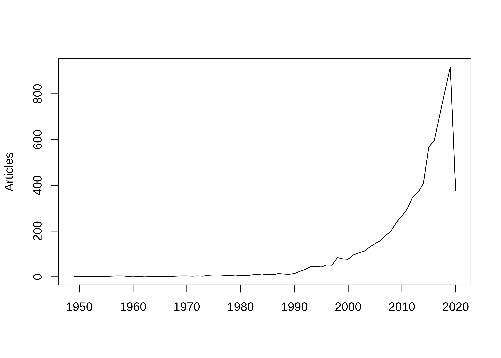

Overview
========

Summary: The goal of this review is to identify the needs for network
analysis of landscape (forests, agriculture, aquatic, built) embodied in
trade to assess the resilience of global human-natural systems to
climate change.

-   Why landscape?
-   Major topics in landscape
    -   Land-use change
    -   Climate change
    -   Invasive/disease organisms
    -   Fire and drought
-   Resilience and sustainability
-   What has been done?
-   Why MRIO?
-   Multi-regional
-   Multi-industry
-   Why networks, why ENA?
-   System-wide impacts through both direct and indirect pathways
-   Feedbacks and cycling
-   Groups and modules
-   ENA is based on IO Analysis framework
-   Compare Approaches (network vs non-network)
    -   ENA
    -   IO analysis
    -   Telecoupling
    -   Footprint analysis
    -   Other? See Ecol. Econ. 2015 114
    -   Virtual systems?
-   What are the priorities?
-   Climate change
-   Land-use change
-   Structural analyses
    -   Targets
    -   Metrics
-   Comparison of network and non-network metrics

Outline
=======

-   Resilience metrics for networks of embodied landscapes
-   Landscape context
-   Disturbances
-   Conversion
-   What is resilience?
-   Ecology and resilience
-   Complex systems resilience
    -   MacArthur
    -   May
    -   Ulanowicz
    -   Sheffer
-   Environmental embodied trade networks
-   IO background
-   Environmental/Social
-   Landscapes
-   Network metrics and resilience
-   FATH
-   Bascompte
-   Ulanowicz
-   Review methods and overview
-   Review: Metrics
-   IO -&gt; MRIO -&gt; EEMRIO
-   LEMRIO
-   IO overlap with ENA
-   ENA(IO) + ENA(LEMRIO)
-   Needs and Directions
-   Climate change
-   Disturbance

Analyses
========

-   What work has been done on landscape mrio?
-   What work has addressed resilience and stability?
-   What ENA metrics have been or could be applied?

<!-- -->

    loadd(io.bdf)

keyword+title: io/mrio
----------------------

    q.mrio <- grepl("INPUT-OUTPUT", io.bdf[, "DE"]) | 
        grepl("INPUT-OUTPUT", io.bdf[, "TI"]) | 
        grepl("INPUT OUTPUT", io.bdf[, "DE"]) | 
        grepl("INPUT OUTPUT", io.bdf[, "TI"]) 

keyword+title: mrio & landscape
-------------------------------

    q.land <- grepl("^LAND", io.bdf[, "DE"]) | 
        grepl("^LAND", io.bdf[, "TI"]) | 
        grepl(" LAND", io.bdf[, "DE"]) | 
        grepl(" LAND", io.bdf[, "TI"]) 

keyword+title: mrio & network/ena
---------------------------------

    q.net <- (grepl("NETWORK ANALYS", io.bdf[, "DE"]) | 
        grepl("NETWORK ANALYS", io.bdf[, "TI"])) & 
        !(grepl("ECOLOGICAL NETWORK ANALYS", io.bdf[, "DE"]) | 
        grepl("ECOLOGICAL NETWORK ANALYS", io.bdf[, "TI"]))
    q.ena <- grepl("ECOLOGICAL NETWORK ANALYS", io.bdf[, "DE"]) | 
        grepl("ECOLOGICAL NETWORK ANALYS", io.bdf[, "TI"]) &
        !(q.net)

keyword+title: resilience
-------------------------

    q.res <- grepl("^RESILIEN", io.bdf[, "TI"]) | 
        grepl("^RESILIEN", io.bdf[, "DE"]) | 
        grepl(" RESILIEN", io.bdf[, "TI"]) | 
        grepl(" RESILIEN", io.bdf[, "DE"]) 
    q.res.abs <- grepl("^RESILIEN", io.bdf[, "TI"]) | 
        grepl("^RESILIEN", io.bdf[, "DE"]) | 
        grepl(" RESILIEN", io.bdf[, "TI"]) | 
        grepl(" RESILIEN", io.bdf[, "DE"]) | 
        grepl("^RESILIEN", io.bdf[, "AB"]) | 
        grepl(" RESILIEN", io.bdf[, "AB"]) 

keyword+title: disturbance(climate change, other)
-------------------------------------------------

    q.mc <- grepl("^CLIMATE", io.bdf[, "TI"]) | 
        grepl("^CLIMATE", io.bdf[, "DE"]) | 
        grepl(" CLIMATE", io.bdf[, "TI"]) | 
        grepl(" CLIMATE", io.bdf[, "DE"]) 
    q.md <- grepl("^DISTURB", io.bdf[, "TI"]) | 
        grepl("^DISTURB", io.bdf[, "DE"]) | 
        grepl(" DISTURB", io.bdf[, "TI"]) | 
        grepl(" DISTURB", io.bdf[, "DE"]) 

keyword+title: coupled-human natural systems
--------------------------------------------

    q.chns <- grepl("HUMAN-NATURAL", io.bdf[, "TI"]) | 
        grepl("HUMAN-NATURAL", io.bdf[, "DE"]) |
        grepl("HUMAN-NATURAL", io.bdf[, "AB"]) |
        grepl("HUMAN NATURAL", io.bdf[, "TI"]) | 
        grepl("HUMAN NATURAL", io.bdf[, "DE"]) |
        grepl("HUMAN NATURAL", io.bdf[, "AB"]) 

keyword+title: ena & resilience+stability & metrics
---------------------------------------------------

    q.met <- grepl(" METRIC", io.bdf[, "TI"]) | 
        grepl(" METRIC", io.bdf[, "DE"]) |
        grepl(" METRIC", io.bdf[, "AB"]) |
        grepl("^METRIC", io.bdf[, "TI"]) | 
        grepl("^METRIC", io.bdf[, "DE"]) |
        grepl("^METRIC", io.bdf[, "AB"]) & 
        q.net &
        q.res
    q.met.land <- q.met & q.land

type: review
------------

    q.rev <- grepl("REVIEW", io.bdf[, "DT"]) | 
        grepl("REVIEW", io.bdf[, "DE"]) | 
        grepl("REVIEW", io.bdf[, "TI"]) 
    q.ov <- grepl("OVERVIEW", io.bdf[, "DT"]) |
        grepl("OVERVIEW", io.bdf[, "DE"]) | 
        grepl("OVERVIEW", io.bdf[, "TI"]) 

Papers
======

QUERY: IO/MRIO
--------------

    head(io.bdf[q.mrio, c("TI")])

    ## [1] "AN INTEGRATED MODELING FRAMEWORK FOR ENERGY ECONOMY AND EMISSIONS MODELING: A CASE FOR INDIA"                                                       
    ## [2] "ESTIMATING THE IMPACTS OF FINANCING SUPPORT POLICIES TOWARDS PHOTOVOLTAIC MARKET IN INDONESIA: A SOCIAL-ENERGY-ECONOMY-ENVIRONMENT MODEL SIMULATION"
    ## [3] "THE SOCIOECONOMIC FUTURE OF DELTAS IN A CHANGING ENVIRONMENT"                                                                                       
    ## [4] "INTER-REGIONAL SPILLOVER OF CHINA'S SULFUR DIOXIDE (SO2) POLLUTION ACROSS THE SUPPLY CHAINS"                                                        
    ## [5] "THE ROLE OF VEHICLE LIFETIME EXTENSIONS OF COUNTRIES ON GLOBAL CO2 EMISSIONS"                                                                       
    ## [6] "DRIVERS OF VIRTUAL WATER FLOWS ON REGIONAL WATER SCARCITY IN CHINA"

QUERY: Reviews/Overviews
------------------------

    io.bdf[q.rev | q.ov, c("TI")]

    ##  [1] "NATURAL GAS OVERVIEW FOR WORLD ECONOMY: FROM PRIMARY SUPPLY TO FINAL DEMAND VIA GLOBAL SUPPLY CHAINS"                                                                  
    ##  [2] "AN OVERVIEW OF ARABLE LAND USE FOR THE WORLD ECONOMY: FROM SOURCE TO SINK VIA THE GLOBAL SUPPLY CHAIN"                                                                 
    ##  [3] "TOWARDS A UNIVERSAL CARBON FOOTPRINT STANDARD: A CASE STUDY OF CARBON MANAGEMENT AT UNIVERSITIES"                                                                      
    ##  [4] "ASSESSING THE URBAN CARBON FOOTPRINT: AN OVERVIEW"                                                                                                                     
    ##  [5] "TOURISM AND ECONOMIC GROWTH: A REVIEW OF INTERNATIONAL LITERATURE"                                                                                                     
    ##  [6] "METABOLISM AND ENVIRONMENTAL IMPACTS OF HOUSEHOLD CONSUMPTION: A REVIEW ON THE ASSESSMENT, METHODOLOGY, AND DRIVERS"                                                   
    ##  [7] "TRADING LAND: A REVIEW OF APPROACHES TO ACCOUNTING FOR UPSTREAM LAND REQUIREMENTS OF TRADED PRODUCTS"                                                                  
    ##  [8] "HOUSEHOLD CARBON EMISSION RESEARCH: AN ANALYTICAL REVIEW OF MEASUREMENT, INFLUENCING FACTORS AND MITIGATION PROSPECTS"                                                 
    ##  [9] "MEASURING TELECOUPLINGS IN THE GLOBAL LAND SYSTEM: A REVIEW AND COMPARATIVE EVALUATION OF LAND FOOTPRINT ACCOUNTING METHODS"                                           
    ## [10] "INPUT-OUTPUT ANALYSIS AND CARBON FOOTPRINTING: AN OVERVIEW OF APPLICATIONS"                                                                                            
    ## [11] "ENVIRONMENT IMPACTS OF PRODUCTS - A DETAILED REVIEW OF STUDIES"                                                                                                        
    ## [12] "A REVIEW OF DIFFERING APPROACHES USED TO ESTIMATE THE COST OF CORROSION (AND THEIR RELEVANCE IN THE DEVELOPMENT OF MODERN CORROSION PREVENTION AND CONTROL STRATEGIES)"
    ## [13] "ENERGY AND CO2 LIFE-CYCLE ANALYSES OF WIND TURBINES - REVIEW AND APPLICATIONS"                                                                                         
    ## [14] "REVIEW OF MODELING TECHNIQUES AND TOOLS FOR DECISION-MAKING IN MANUFACTURING MANAGEMENT"                                                                               
    ## [15] "EMPLOYMENT AND FARMERS' WORK IN EUROPEAN RUMINANT LIVESTOCK FARMS: A REVIEW"                                                                                           
    ## [16] "GLOBAL SOCIO-HYDROLOGY: AN OVERVIEW OF VIRTUAL WATER USE BY THE WORLD ECONOMY FROM SOURCE OF EXPLOITATION TO SINK OF FINAL CONSUMPTION"                                
    ## [17] "GLOBAL OVERVIEW OF CRUDE OIL USE: FROM SOURCE TO SINK THROUGH INTER-REGIONAL TRADE"                                                                                    
    ## [18] "ENERGY USE IN WORLD ECONOMY FROM HOUSEHOLD-CONSUMPTION-BASED PERSPECTIVE"

QUERY: ENA/Network
------------------

    io.bdf[q.ena | q.ov, c("TI")]

    ##  [1] "ENERGY WATER NEXUS UNDER ENERGY MIX SCENARIOS USING INPUT OUTPUT AND ECOLOGICAL NETWORK ANALYSES"                                                                         
    ##  [2] "NATURAL GAS OVERVIEW FOR WORLD ECONOMY: FROM PRIMARY SUPPLY TO FINAL DEMAND VIA GLOBAL SUPPLY CHAINS"                                                                     
    ##  [3] "ECOLOGICAL NETWORK ANALYSIS FOR AN INDUSTRIAL SOLID WASTE METABOLISM SYSTEM"                                                                                              
    ##  [4] "ECOLOGICAL AND ECONOMIC ANALYSES OF THE FOREST METABOLISM SYSTEM: A CASE STUDY OF GUANGDONG PROVINCE, CHINA"                                                              
    ##  [5] "ECOLOGICAL NETWORK ANALYSIS ON INTRA-CITY METABOLISM OF FUNCTIONAL URBAN AREAS IN ENGLAND AND WALES"                                                                      
    ##  [6] "INTERREGIONAL CARBON FLOWS OF CHINA"                                                                                                                                      
    ##  [7] "MULTIREGIONAL INPUT-OUTPUT AND ECOLOGICAL NETWORK ANALYSES FOR REGIONAL ENERGY-WATER NEXUS WITHIN CHINA"                                                                  
    ##  [8] "AN OVERVIEW OF ARABLE LAND USE FOR THE WORLD ECONOMY: FROM SOURCE TO SINK VIA THE GLOBAL SUPPLY CHAIN"                                                                    
    ##  [9] "PROVINCIAL CARBON EMISSIONS REDUCTION ALLOCATION PLAN IN CHINA BASED ON CONSUMPTION PERSPECTIVE"                                                                          
    ## [10] "INTERREGIONAL TRADE AMONG REGIONS OF URBAN ENERGY METABOLISM: A CASE STUDY BETWEEN BEIJING-TIANJIN-HEBEI AND OTHERS IN CHINA"                                             
    ## [11] "MULTI-SCALE ANALYSIS OF THE ENERGY METABOLIC PROCESSES IN THE BEIJING-TIANJIN-HEBEI (JING-JIN-JI) URBAN AGGLOMERATION"                                                    
    ## [12] "ASSESSING THE URBAN CARBON FOOTPRINT: AN OVERVIEW"                                                                                                                        
    ## [13] "ECOLOGICAL UTILITY THEORY: SOLVING A SERIES CONVERGENCE ISSUE"                                                                                                            
    ## [14] "ENERGY-WATER NEXUS OF INTERNATIONAL ENERGY TRADE OF CHINA"                                                                                                                
    ## [15] "ECOLOGICAL NETWORK ANALYSIS OF ENERGY METABOLISM IN THE BEIJING-TIANJIN-HEBEI (JING-JIN-JI) URBAN AGGLOMERATION"                                                          
    ## [16] "HIGHLY VARIABLE MALE COURTSHIP BEHAVIORAL SEQUENCES IN A CRAMBID MOTH"                                                                                                    
    ## [17] "ECOLOGICAL NETWORK ANALYSIS OF EMBODIED PARTICULATE MATTER 2.5-A CASE STUDY OF BEIJING"                                                                                   
    ## [18] "SIX GENERAL ECOSYSTEM PROPERTIES ARE MORE INTENSE IN BIOGEOCHEMICAL CYCLING NETWORKS THAN FOOD WEBS"                                                                      
    ## [19] "ENERGY-WATER NEXUS OF URBAN AGGLOMERATION BASED ON MULTIREGIONAL INPUT-OUTPUT TABLES AND ECOLOGICAL NETWORK ANALYSIS: A CASE STUDY OF THE BEIJING-TIANJIN-HEBEI REGION"   
    ## [20] "ECOLOGICAL NETWORK ANALYSIS OF EMBODIED ENERGY EXCHANGES AMONG THE SEVEN REGIONS OF CHINA"                                                                                
    ## [21] "ECOLOGICAL NETWORK ANALYSIS OF THE VIRTUAL WATER NETWORK WITHIN CHINA'S ELECTRIC POWER SYSTEM DURING 2007-2012"                                                           
    ## [22] "URBAN ENERGY FLOW PROCESSES IN THE BEIJING-TIANJIN-HEBEI (JING-JIN-JI) URBAN AGGLOMERATION: COMBINING MULTI-REGIONAL INPUT-OUTPUT TABLES WITH ECOLOGICAL NETWORK ANALYSIS"
    ## [23] "MULTI-REGIONAL INPUT-OUTPUT MODEL AND ECOLOGICAL NETWORK ANALYSIS FOR REGIONAL EMBODIED ENERGY ACCOUNTING IN CHINA"                                                       
    ## [24] "URBAN ENERGY CONSUMPTION: DIFFERENT INSIGHTS FROM ENERGY FLOW ANALYSIS, INPUT-OUTPUT ANALYSIS AND ECOLOGICAL NETWORK ANALYSIS"                                            
    ## [25] "EQUIVALENCE OF THE REALIZED INPUT AND OUTPUT ORIENTED INDIRECT EFFECTS METRICS IN ECOLOGICAL NETWORK ANALYSIS"                                                            
    ## [26] "INPUT-OUTPUT ANALYSIS AND CARBON FOOTPRINTING: AN OVERVIEW OF APPLICATIONS"                                                                                               
    ## [27] "A MATLAB (R) FUNCTION FOR NETWORK ENVIRON ANALYSIS"                                                                                                                       
    ## [28] "UNFOLDING INTERREGIONAL ENERGY FLOW STRUCTURE OF CHINA'S CONSTRUCTION SECTOR BASED ON PROVINCE-LEVEL DATA"                                                                
    ## [29] "CHARACTERISTICS OF TIANJIN'S MATERIAL METABOLISM FROM THE PERSPECTIVE OF ECOLOGICAL NETWORK ANALYSIS"                                                                     
    ## [30] "AN ECOLOGICAL-THERMODYNAMIC APPROACH TO URBAN METABOLISM: MEASURING RESOURCE UTILIZATION WITH OPEN SYSTEM NETWORK EFFECTIVENESS ANALYSIS"                                 
    ## [31] "EVALUATING CHROMIUM COUPLED WITH CARBON METABOLISM AND ENVIRONMENTAL PERFORMANCE IN THE CHROMATE INDUSTRIAL SYMBIOSIS NETWORK IN CHINA"                                   
    ## [32] "ECOLOGICAL NETWORK ANALYSIS OF AN ENERGY METABOLISM SYSTEM BASED ON INPUT-OUTPUT TABLES: MODEL DEVELOPMENT AND CASE STUDY FOR GUANGDONG"                                  
    ## [33] "GLOBAL SOCIO-HYDROLOGY: AN OVERVIEW OF VIRTUAL WATER USE BY THE WORLD ECONOMY FROM SOURCE OF EXPLOITATION TO SINK OF FINAL CONSUMPTION"                                   
    ## [34] "CHARACTERIZING THE EMBODIED CARBON EMISSIONS FLOWS AND ECOLOGICAL RELATIONSHIPS AMONG FOUR CHINESE MEGACITIES AND OTHER PROVINCES"                                        
    ## [35] "GLOBAL OVERVIEW OF CRUDE OIL USE: FROM SOURCE TO SINK THROUGH INTER-REGIONAL TRADE"                                                                                       
    ## [36] "METABOLISM OF URBAN WASTEWATER: ECOLOGICAL NETWORK ANALYSIS FOR GUANGDONG PROVINCE, CHINA"                                                                                
    ## [37] "ENERGY USE IN WORLD ECONOMY FROM HOUSEHOLD-CONSUMPTION-BASED PERSPECTIVE"                                                                                                 
    ## [38] "INFORMATION-BASED ECOLOGICAL NETWORK ANALYSIS FOR CARBON EMISSIONS"                                                                                                       
    ## [39] "WATER-LAND NEXUS IN FOOD TRADE BASED ON ECOLOGICAL NETWORK ANALYSIS"

    io.bdf[q.net | q.ov, c("TI")]

    ##  [1] "LAND COMPETITION UNDER TELECOUPLING: DISTANT ACTORS' ENVIRONMENTAL VERSUS ECONOMIC CLAIMS ON LAND IN NORTH-EASTERN MADAGASCAR"                                                                  
    ##  [2] "NATURAL GAS OVERVIEW FOR WORLD ECONOMY: FROM PRIMARY SUPPLY TO FINAL DEMAND VIA GLOBAL SUPPLY CHAINS"                                                                                           
    ##  [3] "DYNAMIC INPUT-OUTPUT ANALYSIS FOR ENERGY METABOLISM SYSTEM IN THE PROVINCE OF GUANGDONG, CHINA"                                                                                                 
    ##  [4] "EVOLUTION OF THE SCIENTIFIC LITERATURE ON INPUT-OUTPUT ANALYSIS: A BIBLIOMETRIC ANALYSIS OF 1990-2017"                                                                                          
    ##  [5] "VISUALIZING THE CHANGE OF EMBODIED CO2 EMISSIONS ALONG GLOBAL PRODUCTION CHAINS"                                                                                                                
    ##  [6] "A NETWORK ANALYSIS OF INDIRECT CARBON EMISSION FLOWS AMONG DIFFERENT INDUSTRIES IN CHINA"                                                                                                       
    ##  [7] "AN OVERVIEW OF ARABLE LAND USE FOR THE WORLD ECONOMY: FROM SOURCE TO SINK VIA THE GLOBAL SUPPLY CHAIN"                                                                                          
    ##  [8] "SYSTEMIC RISK IN THE GLOBAL WATER INPUT-OUTPUT NETWORK"                                                                                                                                         
    ##  [9] "INDUSTRIAL CHARACTERISTICS AND CONSUMPTION EFFICIENCY FROM A NEXUS PERSPECTIVE - BASED ON ANHUI'S EMPIRICAL STATISTICS"                                                                         
    ## [10] "AN INQUIRY INTO WATER TRANSFER NETWORK OF THE YANGTZE RIVER ECONOMIC BELT IN CHINA"                                                                                                             
    ## [11] "EMERGY NETWORK ANALYSIS OF CHINESE SECTORAL ECOLOGICAL SUSTAINABILITY"                                                                                                                          
    ## [12] "GLOBAL ENERGY FLOWS EMBODIED IN INTERNATIONAL TRADE: A COMBINATION OF ENVIRONMENTALLY EXTENDED INPUT-OUTPUT ANALYSIS AND COMPLEX NETWORK ANALYSIS"                                              
    ## [13] "FLOWBCA: A FLOW-BASED CLUSTER ALGORITHM IN STATA"                                                                                                                                               
    ## [14] "EXAMINING INDUSTRIAL STRUCTURE CHANGES AND CORRESPONDING CARBON EMISSION REDUCTION EFFECT BY COMBINING INPUT-OUTPUT ANALYSIS AND SOCIAL NETWORK ANALYSIS: A COMPARISON STUDY OF CHINA AND JAPAN"
    ## [15] "ASSESSING THE URBAN CARBON FOOTPRINT: AN OVERVIEW"                                                                                                                                              
    ## [16] "IDENTIFY SECTORS' ROLE ON THE EMBEDDED CO2 TRANSFER NETWORKS THROUGH CHINA'S REGIONAL TRADE"                                                                                                    
    ## [17] "NETWORK ANALYSIS OF INTER-SECTORAL RELATIONSHIPS AND KEY SECTORS IN THE GREEK ECONOMY"                                                                                                          
    ## [18] "AN URBAN METABOLISM AND CARBON FOOTPRINT ANALYSIS OF THE JING-JIN-JI REGIONAL AGGLOMERATION"                                                                                                    
    ## [19] "AUSTRALIA'S REGIONAL INNOVATION SYSTEMS: INTER-INDUSTRY INTERACTION IN INNOVATIVE ACTIVITIES IN THREE AUSTRALIAN TERRITORIES"                                                                   
    ## [20] "URBAN ENERGY-WATER NEXUS: A NETWORK PERSPECTIVE"                                                                                                                                                
    ## [21] "UNEQUAL CARBON EXCHANGES THE ENVIRONMENTAL AND ECONOMIC IMPACTS OF ICONIC US CONSUMPTION ITEMS"                                                                                                 
    ## [22] "WEALTH AND POLLUTION INEQUALITIES OF GLOBAL TRADE: A NETWORK AND INPUT-OUTPUT APPROACH"                                                                                                         
    ## [23] "ANALYSIS OF URBAN ENERGY CONSUMPTION IN CARBON METABOLIC PROCESSES AND ITS STRUCTURAL ATTRIBUTES: A CASE STUDY FOR BEIJING"                                                                     
    ## [24] "ECOSYSTEM NETWORK ANALYSIS INDICATORS ARE GENERALLY ROBUST TO PARAMETER UNCERTAINTY IN A PHOSPHORUS MODEL OF LAKE SIDNEY LANIER, USA"                                                           
    ## [25] "APPLYING SOCIAL NETWORK ANALYSIS TO INPUT-OUTPUT BASED INNOVATION MATRICES: AN ILLUSTRATIVE APPLICATION TO SIX OECD TECHNOLOGICAL SYSTEMS FOR THE MIDDLE 1990S"                                 
    ## [26] "INPUT-OUTPUT ANALYSIS AND CARBON FOOTPRINTING: AN OVERVIEW OF APPLICATIONS"                                                                                                                     
    ## [27] "LEAST-INFERENCE METHODS FOR CONSTRUCTING NETWORKS OF TROPHIC FLOWS"                                                                                                                             
    ## [28] "THEORY OF MATERIALS AND ENERGY FLOW ANALYSIS IN ECOLOGY AND ECONOMICS"                                                                                                                          
    ## [29] "NETWORK ANALYSIS APPLIED TO LARGE-SCALE CYBER-ECOSYSTEMS"                                                                                                                                       
    ## [30] "NETWORK SYNERGISM: EMERGENCE OF POSITIVE RELATIONS IN ECOLOGICAL SYSTEMS"                                                                                                                       
    ## [31] "CARBON BUDGET AND NETWORK ANALYSIS OF A HIGH-ENERGY BEACH/SURF-ZONE ECOSYSTEM"                                                                                                                  
    ## [32] "NETWORK ANALYSIS AS A TOOL FOR QUANTIFYING THE DYNAMICS OF METACOUPLED SYSTEMS: AN EXAMPLE USING GLOBAL SOYBEAN TRADE"                                                                          
    ## [33] "LINKING AGRICULTURAL GHG EMISSIONS TO GLOBAL TRADE NETWORK"                                                                                                                                     
    ## [34] "EVOLUTION OF VIRTUAL WATER METABOLIC NETWORK IN DEVELOPING REGIONS: A CASE STUDY OF GUANGDONG PROVINCE"                                                                                         
    ## [35] "CARBON COMMUNITIES AND HOTSPOTS FOR CARBON EMISSIONS REDUCTION IN CHINA"                                                                                                                        
    ## [36] "ENERGY FOOTPRINT PATHWAYS OF CHINA"                                                                                                                                                             
    ## [37] "A STUDY ON EMBODIED CARBON TRANSFER AT THE PROVINCIAL LEVEL OF CHINA FROM A SOCIAL NETWORK PERSPECTIVE"                                                                                         
    ## [38] "LINKAGE ANALYSIS OF TOURISM-RELATED SECTORS IN CHINA: AN ASSESSMENT BASED ON NETWORK ANALYSIS TECHNIQUE"                                                                                        
    ## [39] "ENERGY-INDUCED MERCURY EMISSIONS IN GLOBAL SUPPLY CHAIN NETWORKS: STRUCTURAL CHARACTERISTICS AND POLICY IMPLICATIONS"                                                                           
    ## [40] "GLOBAL SOCIO-HYDROLOGY: AN OVERVIEW OF VIRTUAL WATER USE BY THE WORLD ECONOMY FROM SOURCE OF EXPLOITATION TO SINK OF FINAL CONSUMPTION"                                                         
    ## [41] "GLOBAL OVERVIEW OF CRUDE OIL USE: FROM SOURCE TO SINK THROUGH INTER-REGIONAL TRADE"                                                                                                             
    ## [42] "ENERGY USE IN WORLD ECONOMY FROM HOUSEHOLD-CONSUMPTION-BASED PERSPECTIVE"                                                                                                                       
    ## [43] "NETWORK ANALYSIS OF DIFFERENT TYPES OF FOOD FLOWS: ESTABLISHING THE INTERACTION BETWEEN FOOD FLOWS AND ECONOMIC FLOWS"

QUERY: Metrics
--------------

    io.bdf[q.met, c("TI")]

    ##  [1] "OUTSOURCING NATURAL RESOURCE REQUIREMENTS WITHIN CHINA"                                                                                                                              
    ##  [2] "NEXUS STRENGTH: A NOVEL METRIC FOR ASSESSING THE GLOBAL RESOURCE NEXUS"                                                                                                              
    ##  [3] "TRACING NATURAL RESOURCE USES VIA CHINA'S SUPPLY CHAINS"                                                                                                                             
    ##  [4] "ELECTRICITY GENERATION TECHNOLOGIES: COMPARISON OF MATERIALS USE, ENERGY RETURN ON INVESTMENT, JOBS CREATION AND CO2 EMISSIONS REDUCTION"                                            
    ##  [5] "THE EVOLUTION OF SUSTAINABILITY MEASUREMENT RESEARCH"                                                                                                                                
    ##  [6] "CARBON EMISSIONS PINCH ANALYSIS OF ECONOMIC SYSTEMS"                                                                                                                                 
    ##  [7] "MODELLING MULTI-REGIONAL ECOLOGICAL EXCHANGES: THE CASE OF UK AND AFRICA"                                                                                                            
    ##  [8] "INTERPROVINCIAL TRANSFER OF EMBODIED PRIMARY ENERGY IN CHINA: A COMPLEX NETWORK APPROACH"                                                                                            
    ##  [9] "EMBODIED CARBON AS A PROXY FOR THE ENVIRONMENTAL IMPACT OF EARTHQUAKE DAMAGE REPAIR"                                                                                                 
    ## [10] "IDENTIFICATION OF THE CRITICAL TRANSMISSION SECTORS AND TYPOLOGY OF INDUSTRIAL WATER USE FOR SUPPLY-CHAIN WATER PRESSURE MITIGATION"                                                 
    ## [11] "SOCIAL LIFE CYCLE ASSESSMENT OF FIRST AND SECOND-GENERATION ETHANOL PRODUCTION TECHNOLOGIES IN BRAZIL"                                                                               
    ## [12] "THE WATER-ENERGY-FOOD NEXUS IN EAST ASIA: A TELE-CONNECTED VALUE CHAIN ANALYSIS USING INTER-REGIONAL INPUT-OUTPUT ANALYSIS"                                                          
    ## [13] "A MULTI-REGION INPUT-OUTPUT MODEL FOR OPTIMIZING VIRTUAL WATER TRADE FLOWS IN AGRICULTURAL CROP PRODUCTION"                                                                          
    ## [14] "AN INPUT-OUTPUT BASED NET-ENERGY ASSESSMENT OF AN ELECTRICITY SUPPLY INDUSTRY"                                                                                                       
    ## [15] "PRODUCTION AND CONSUMPTION-BASED WATER DYNAMICS: A LONGITUDINAL ANALYSIS FOR THE EU27"                                                                                               
    ## [16] "THERMODYNAMIC INSIGHTS AND ASSESSMENT OF THE `CIRCULAR ECONOMY'"                                                                                                                     
    ## [17] "NETWORK ANALYSIS OF INTER-SECTORAL RELATIONSHIPS AND KEY SECTORS IN THE GREEK ECONOMY"                                                                                               
    ## [18] "URBAN ENERGY-WATER NEXUS BASED ON MODIFIED INPUT-OUTPUT ANALYSIS"                                                                                                                    
    ## [19] "INPUT-OUTPUT ANALYSIS OF INTERNATIONAL RESEARCH COLLABORATIONS: A CASE STUDY OF FIVE US UNIVERSITIES"                                                                                
    ## [20] "LOSS AND BENEFIT CAUSED BY A DIESEL ENGINE FROM THE PERSPECTIVE OF HUMAN HEALTH"                                                                                                     
    ## [21] "CARBON FOOTPRINT STOCK ANALYSIS OF US MANUFACTURING: A TIME SERIES INPUT-OUTPUT LCA"                                                                                                 
    ## [22] "THE VIRTUAL IELAB - AN EXERCISE IN REPLICATING PART OF THE EXIOBASE V.2 PRODUCTION PIPELINE IN A VIRTUAL LABORATORY"                                                                 
    ## [23] "REGIONAL DISTRIBUTION AND LOSSES OF END-OF-LIFE STEEL THROUGHOUT MULTIPLE PRODUCT LIFE CYCLES INSIGHTS FROM THE GLOBAL MULTIREGIONAL MATRACE MODEL"                                  
    ## [24] "A FUZZY DATA ENVELOPMENT ANALYSIS FRAMEWORK FOR DEALING WITH UNCERTAINTY IMPACTS OF INPUT-OUTPUT LIFE CYCLE ASSESSMENT MODELS ON ECO-EFFICIENCY ASSESSMENT"                          
    ## [25] "TRACKING INTER-REGIONAL CARBON FLOWS: A HYBRID NETWORK MODEL"                                                                                                                        
    ## [26] "ESTIMATION OF ECONOMIC IMPACTS OF CELLULOSIC BIOFUEL PRODUCTION: A COMPARATIVE ANALYSIS OF THREE BIOFUEL PATHWAYS"                                                                   
    ## [27] "INTEGRATING EXPERT WEIGHTING AND MULTI-CRITERIA DECISION MAKING INTO ECO-EFFICIENCY ANALYSIS: THE CASE OF US MANUFACTURING"                                                          
    ## [28] "AN INTEGRATED MODEL FOR MARINE FISHERY MANAGEMENT IN THE PEARL RIVER ESTUARY: LINKING SOCIO-ECONOMIC SYSTEMS AND ECOSYSTEMS"                                                         
    ## [29] "INPUT-OUTPUT LIFE CYCLE ENVIRONMENTAL ASSESSMENT OF GREENHOUSE GAS EMISSIONS FROM UTILITY SCALE WIND ENERGY IN THE UNITED STATES"                                                    
    ## [30] "ACCOUNTING FOR HIDDEN ENERGY DEPENDENCY: THE IMPACT OF ENERGY EMBODIED IN TRADED GOODS ON CROSS-COUNTRY ENERGY SECURITY ASSESSMENTS"                                                 
    ## [31] "RISK ASSESSMENT OF THE ECONOMIC IMPACTS OF CLIMATE CHANGE ON THE IMPLEMENTATION OF MANDATORY BIODIESEL BLENDING PROGRAMS: A FUZZY INOPERABILITY INPUT-OUTPUT MODELING (IIM) APPROACH"
    ## [32] "FLOW DISTANCES ON OPEN FLOW NETWORKS"                                                                                                                                                
    ## [33] "TRADING LAND: A REVIEW OF APPROACHES TO ACCOUNTING FOR UPSTREAM LAND REQUIREMENTS OF TRADED PRODUCTS"                                                                                
    ## [34] "A NETWORK OF NETWORKS PERSPECTIVE ON GLOBAL TRADE"                                                                                                                                   
    ## [35] "THE FOOTPRINT OF USING METALS: NEW METRICS OF CONSUMPTION AND PRODUCTIVITY"                                                                                                          
    ## [36] "LABOR EMBODIED IN TRADE: THE ROLE OF LABOR AND ENERGY PRODUCTIVITY AND IMPLICATIONS FOR GREENHOUSE GAS EMISSIONS"                                                                    
    ## [37] "A STOCHASTIC RECOVERY MODEL OF INFLUENZA PANDEMIC EFFECTS ON INTERDEPENDENT WORKFORCE SYSTEMS"                                                                                       
    ## [38] "EQUIVALENCE OF THE REALIZED INPUT AND OUTPUT ORIENTED INDIRECT EFFECTS METRICS IN ECOLOGICAL NETWORK ANALYSIS"                                                                       
    ## [39] "INVENTORY DEVELOPMENT AND INPUT-OUTPUT MODEL OF US LAND USE: RELATING LAND IN PRODUCTION TO CONSUMPTION"                                                                             
    ## [40] "EMERGY ANALYSIS USING US ECONOMIC INPUT-OUTPUT MODELS WITH APPLICATIONS TO LIFE CYCLES OF GASOLINE AND CORN ETHANOL"                                                                 
    ## [41] "GREENHOUSE GAS EMISSIONS IN HAWAI'I: HOUSEHOLD AND VISITOR EXPENDITURE ANALYSIS"                                                                                                     
    ## [42] "SOLUTIONS TO STRATEGIC SUPPLY CHAIN MAPPING ISSUES"                                                                                                                                  
    ## [43] "1,3-PROPANEDIOL FROM FOSSILS VERSUS BIOMASS: A LIFE CYCLE EVALUATION OF EMISSIONS AND ECOLOGICAL RESOURCES"                                                                          
    ## [44] "ECOLOGICAL INPUT-OUTPUT ANALYSIS-BASED SUSTAINABILITY ANALYSIS OF INDUSTRIAL SYSTEMS"                                                                                                
    ## [45] "MEASURING MATERIAL CYCLING IN INDUSTRIAL SYSTEMS"                                                                                                                                    
    ## [46] "A FRAMEWORK FOR LINKING CYBERSECURITY METRICS TO THE MODELING OF MACROECONOMIC INTERDEPENDENCIES"                                                                                    
    ## [47] "INDUSTRIAL AND ECOLOGICAL CUMULATIVE EXERGY CONSUMPTION OF THE UNITED STATES VIA THE 1997 INPUT-OUTPUT BENCHMARK MODEL"                                                              
    ## [48] "FLOW OF NATURAL VERSUS ECONOMIC CAPITAL IN INDUSTRIAL SUPPLY NETWORKS AND ITS IMPLICATIONS TO SUSTAINABILITY"                                                                        
    ## [49] "HIERARCHICAL THERMODYNAMIC METRICS FOR EVALUATING THE ENVIRONMENTAL SUSTAINABILITY OF INDUSTRIAL PROCESSES"                                                                          
    ## [50] "THERMODYNAMIC ACCOUNTING OF ECOSYSTEM CONTRIBUTION TO ECONOMIC SECTORS WITH APPLICATION TO 1992 US ECONOMY"                                                                          
    ## [51] "A HIERARCHIC METRIC APPROACH FOR INTEGRATION OF GREEN ISSUES IN MANUFACTURING: A PAPER RECYCLING APPLICATION"                                                                        
    ## [52] "ENVIRONMENTAL IMPLICATIONS OF SERVICE INDUSTRIES"                                                                                                                                    
    ## [53] "INPUT-OUTPUT-ANALYSIS OF ENERGY-REQUIREMENTS FOR SHORT ROTATION, INTENSIVE CULTURE, WOODY BIOMASS"                                                                                   
    ## [54] "HISTORICAL GLOBAL GRIDDED DEGREE-DAYS: A HIGH-SPATIAL RESOLUTION DATABASE OF CDD AND HDD"                                                                                            
    ## [55] "RECENT CLIMATOLOGICAL TRENDS AND POTENTIAL INFLUENCES ON FOREST PHENOLOGY AROUND WESTERN LAKE SUPERIOR, USA"                                                                         
    ## [56] "HOW WELL CAN CMIP5 SIMULATE PRECIPITATION AND ITS CONTROLLING PROCESSES OVER TROPICAL SOUTH AMERICA?"                                                                                
    ## [57] "THE ASIAN SUMMER MONSOON: AN INTERCOMPARISON OF CMIP5 VS. CMIP3 SIMULATIONS OF THE LATE 20TH CENTURY"                                                                                
    ## [58] "OUTSOURCING, TRADE, TECHNOLOGY, AND GREENHOUSE GAS EMISSIONS"                                                                                                                        
    ## [59] "CARBON FOOTPRINT OF JAPANESE HEALTH CARE SERVICES FROM 2011 TO 2015"                                                                                                                 
    ## [60] "LIFE CYCLE SUSTAINABILITY ASSESSMENT OF AUTONOMOUS HEAVY-DUTY TRUCKS"                                                                                                                
    ## [61] "THE CIRCULARITY GAP OF NATIONS: A MULTIREGIONAL ANALYSIS OF WASTE GENERATION, RECOVERY, AND STOCK DEPLETION IN 2011"                                                                 
    ## [62] "CARBON COMMUNITIES AND HOTSPOTS FOR CARBON EMISSIONS REDUCTION IN CHINA"                                                                                                             
    ## [63] "DOES THE STRUCTURE OF INTERSECTORAL EMBEDDED CARBON FLOW NETWORK MATTER TO CARBON REDUCTION IN CHINA?"                                                                               
    ## [64] "ASSESSING REGIONAL AND GLOBAL ENVIRONMENTAL FOOTPRINTS AND VALUE ADDED OF THE LARGEST FOOD PRODUCERS IN THE WORLD"                                                                   
    ## [65] "THE RAW MATERIAL BASIS OF GLOBAL VALUE CHAINS: ALLOCATING ENVIRONMENTAL RESPONSIBILITY BASED ON VALUE GENERATION"                                                                    
    ## [66] "A METHOD FOR ECONOMIC INPUT-OUTPUT SOCIAL IMPACT ANALYSIS WITH APPLICATION TO US ADVANCED MANUFACTURING"

    io.bdf[q.met & q.land, c("TI")]

    ## [1] "MODELLING MULTI-REGIONAL ECOLOGICAL EXCHANGES: THE CASE OF UK AND AFRICA"                               
    ## [2] "TRADING LAND: A REVIEW OF APPROACHES TO ACCOUNTING FOR UPSTREAM LAND REQUIREMENTS OF TRADED PRODUCTS"   
    ## [3] "INVENTORY DEVELOPMENT AND INPUT-OUTPUT MODEL OF US LAND USE: RELATING LAND IN PRODUCTION TO CONSUMPTION"

QUERY: Resilience
-----------------

    io.bdf[q.res, c("TI")]

    ##  [1] "ECONOMIC CRISIS AND REGIONAL RESILIENCE: EVIDENCE FROM GREECE"                                                                                                              
    ##  [2] "CATCHMENT METABOLISM: INTEGRATING NATURAL CAPITAL IN THE ASSET MANAGEMENT PORTFOLIO OF THE WATER SECTOR"                                                                    
    ##  [3] "INOPERABILITY INPUT-OUTPUT MODELING: INVENTORY OPTIMIZATION AND RESILIENCE ESTIMATION DURING CRITICAL EVENTS"                                                               
    ##  [4] "EXAMINING THE RESILIENCE OF NATIONAL ENERGY SYSTEMS: MEASUREMENTS OF DIVERSITY IN PRODUCTION-BASED AND CONSUMPTION-BASED ELECTRICITY IN THE GLOBALIZATION OF TRADE NETWORKS"
    ##  [5] "INTERCONNECTEDNESS AND INTERDEPENDENCIES OF CRITICAL INFRASTRUCTURES IN THE US ECONOMY: IMPLICATIONS FOR RESILIENCE"                                                        
    ##  [6] "ECONOMIC IMPACT OF PRODUCTION BOTTLENECKS CAUSED BY DISASTERS IMPACTING INTERDEPENDENT INDUSTRY SECTORS"                                                                    
    ##  [7] "ENERGY IMPORT RESILIENCE WITH INPUT-OUTPUT LINEAR PROGRAMMING MODELS"                                                                                                       
    ##  [8] "SMALLHOLDER TELECOUPLING AND POTENTIAL SUSTAINABILITY"                                                                                                                      
    ##  [9] "MODELING TELECONNECTED URBAN SOCIAL-ECOLOGICAL SYSTEMS: OPPORTUNITIES AND CHALLENGES FOR RESILIENCE RESEARCH"                                                               
    ## [10] "TOWARD SUSTAINABLE CLIMATE CHANGE ADAPTATION"                                                                                                                               
    ## [11] "ENERGY-ECONOMIC RESILIENCE WITH MULTI-REGION INPUT-OUTPUT LINEAR PROGRAMMING MODELS"                                                                                        
    ## [12] "MULTI-CRITERIA DECISION-MAKING FOR SEISMIC RESILIENCE AND SUSTAINABILITY ASSESSMENT OF DIAGRID BUILDINGS"                                                                   
    ## [13] "ANALYSING ECONOMIC IMPACT ON INTERDEPENDENT INFRASTRUCTURE AFTER FLOOD: PAKISTAN A CASE IN POINT"

Literature Review: Methods and Background
=========================================

    kw <- gsub(";", "", unlist(strsplit(io.bdf[, "DE"], split = "; ")))
    kw <- sapply(kw, rm.spch)
    kw <- unlist(strsplit(kw, " "))
    kw.tab <- table(kw)

<table>
<thead>
<tr class="header">
<th align="left">topic</th>
<th align="right">count</th>
<th align="right">percent</th>
</tr>
</thead>
<tbody>
<tr class="odd">
<td align="left">IO_MRIO</td>
<td align="right">2005</td>
<td align="right">62.62</td>
</tr>
<tr class="even">
<td align="left">Land</td>
<td align="right">171</td>
<td align="right">5.34</td>
</tr>
<tr class="odd">
<td align="left">Climate Change</td>
<td align="right">174</td>
<td align="right">5.43</td>
</tr>
<tr class="even">
<td align="left">Resilience</td>
<td align="right">13</td>
<td align="right">0.41</td>
</tr>
<tr class="odd">
<td align="left">Metric</td>
<td align="right">66</td>
<td align="right">2.06</td>
</tr>
<tr class="even">
<td align="left">Network</td>
<td align="right">36</td>
<td align="right">1.12</td>
</tr>
<tr class="odd">
<td align="left">ENA</td>
<td align="right">32</td>
<td align="right">1.00</td>
</tr>
<tr class="even">
<td align="left">CHNS</td>
<td align="right">7</td>
<td align="right">0.22</td>
</tr>
<tr class="odd">
<td align="left">Land Metrics</td>
<td align="right">3</td>
<td align="right">0.09</td>
</tr>
<tr class="even">
<td align="left">Review</td>
<td align="right">18</td>
<td align="right">0.56</td>
</tr>
<tr class="odd">
<td align="left">Total</td>
<td align="right">3202</td>
<td align="right">100.00</td>
</tr>
</tbody>
</table>

    export_query(io.bdf, q.all, dir = "data/wos-mrio_query", overwrite = TRUE)

    ##  [1] "IO_MRIO.csv"        "Land.csv"           "Climate_Change.csv"
    ##  [4] "Resilience.csv"     "Metric.csv"         "Network.csv"       
    ##  [7] "ENA.csv"            "CHNS.csv"           "Land_Metrics.csv"  
    ## [10] "Review.csv"        
    ## [1] "Successfully written to data/wos-mrio_query"

    mk_review(io.bdf, q.all[-1], file = "results/wos_review.md", overwrite = TRUE)

<!-- q.all <- list("IO_MRIO" = q.mrio, Land = q.land, Resilience = q.res, -->
<!--              "Climate Change" = q.mc,  -->
<!--              Metric = q.met, Network = q.net, ENA = q.ena, CHNS = q.chns,  -->
<!--              "Land Metrics" = q.met.land, Review = (q.rev | q.ov)) -->
Searched and Reviewed "Land" Query
----------------------------------

-   Searched within queried papers and found papers with MRIO, network
    or resilience
-   Need to add telecoupling and land-system science articles
-   Recompile using a cross-referencing = LAND & MRIO | NETWORK |
    RESILIENCE | SUSTAINABILITY

References
==========
