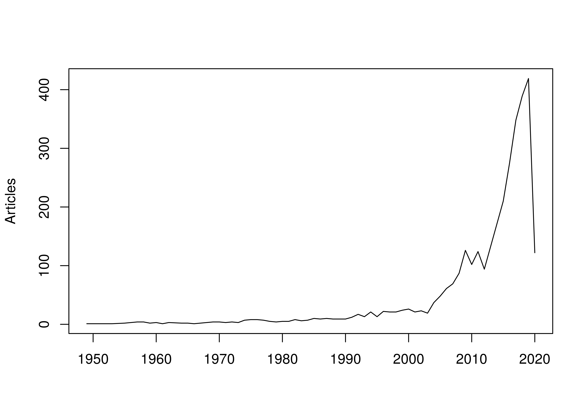

-   What work has been done on landscape mrio?
-   What work has addressed resilience and stability?
-   What ENA metrics have been or could be applied?

Analyses
========

-   keyword+title: mrio & landscape
-   keyword+title: mrio & ena
-   keyword+title: " & resilience+stability
-   keyword+title: mrio & disturbance(climate change, other)
-   keyword+title: coupled-human natural systems
-   keyword+title: ena & resilience+stability & metrics

Figure caption here

@ref(fig:figRef)

@ref(tab:tabRef)

References
==========
